## 1) Data Visualization: Flights at ABIA

### Introduction

In this section, we are looking at a 2008 dataset that contains
information on every commercial flight coming in and out of the
Austin-Bergstrom Internationial Airport. We are interested in seeing
which cities in the dataset have the highest average departure delays.

### Methods

To explore the data and create visualizations, we first need to import
the `tidyverse` and `ggplot2` packages and read the `ABIA.csv` file
which contains the data. Since we are also interested in visualizing the
data on a geographical map, we will also import the `ggmap` package and
read the `airport-codes` files, which contain the latitude and longitude
reading of each airport.

First, the `airport_codes` dataframe is cleaned to exclude closed
airports and drop rows with NA’s or no available IATA-codes. Then, the
`airport_codes` dataframe is joined with `abia` dataframe, so each US
airport in our targeted dataframe has a respective value for longitude
and latitude.

Then, we calculate the average departure delay from each Origin airport.
Airports with the highest departure delays include: Knoxville, TN;
Birmingham, AL; Washington, D.C.; Raleigh/Durham, NC; San Antonio, TX;
Philadelphia, PA.

<table>
<caption>Top 6 Cities with Highest Departure Delays</caption>
<thead>
<tr class="header">
<th style="text-align: left;">Origin</th>
<th style="text-align: right;">avg_delay_time</th>
</tr>
</thead>
<tbody>
<tr class="odd">
<td style="text-align: left;">TYS</td>
<td style="text-align: right;">68.33333</td>
</tr>
<tr class="even">
<td style="text-align: left;">BHM</td>
<td style="text-align: right;">38.00000</td>
</tr>
<tr class="odd">
<td style="text-align: left;">IAD</td>
<td style="text-align: right;">28.39550</td>
</tr>
<tr class="even">
<td style="text-align: left;">RDU</td>
<td style="text-align: right;">27.93450</td>
</tr>
<tr class="odd">
<td style="text-align: left;">SAT</td>
<td style="text-align: right;">25.50000</td>
</tr>
<tr class="even">
<td style="text-align: left;">PHL</td>
<td style="text-align: right;">20.67241</td>
</tr>
</tbody>
</table>

Top 6 Cities with Highest Departure Delays

We will use a barplot to visualize a larger portion of the dataset,
looking at the top 20 cities with the highest departure delays.

From the plot, we see that Knoxville has, on average, significantly
higher delays than Birmingham (with departure delays close to 70 minutes
for Knoxville and near 40 minutes for Birmingham). In comparison, the
average delays for the remaining cities stay below 30 minutes.

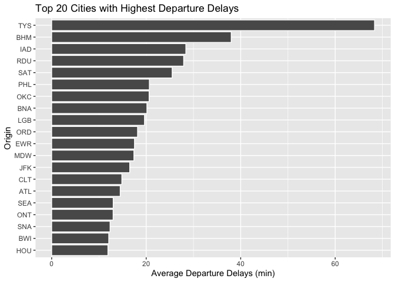

We will visualize the data for all 53 cities included on the dataset by
plotting the points on the US map. This will not only show us average
airport delays but also give us a brief look at all of the US cities
that flyers can travel to from Austin-Bergstrom Internationial Airport.

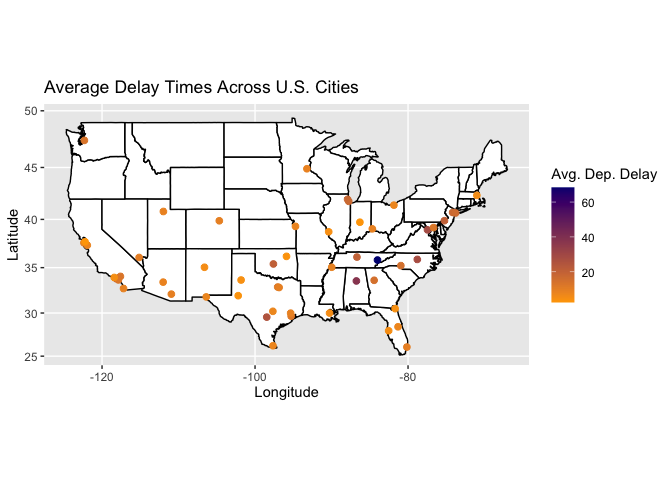

### Results and Conclusion

Based on the results of the plots, we see that Knoxville and Birmingham
experience significantly higher departure delays compared to other
cities.

From the data visualization generated in this section, we were able to
identify airports that experienced the highest average departure delays.
This information can help future flyers know what to expect in terms of
departure delays when traveling to Austin.

Of course, this brief data exploration and visualization report comes
with its own set of limitations. Departure delays are influenced by
holiday rushes and weather conditions, so outliers from unusual weather
or from other potential problems may skew results. Furthermore, the
dataset only includes observations from 2008 and delays may affect each
airport differently on a yearly basis.

## 2) Wrangling the Olympics

### A) What is the 95th percentile of heights for female competitors across all Athletics events (i.e., track and field)? Note that “sport” is the broad sport (e.g. Athletics) whereas “event” is the specific event (e.g. 100 meter sprint).

The 95th percentile of heights for female competitors across all
Athletics events was obtained by first sub-setting the values in the
‘olympics\_top20.csv’ file to observations with the sex variable equal
to “F” and the sport variable equal to “Athletic”. Then, the quantile
function was used to get the 95th quantile of the height of female track
and field (“Athletic”) Olympians, which was 183cm.

### B) Which single women’s “event” had the greatest variability in competitor’s heights across the entire history of the Olympics, as measured by the standard deviation?

<table>
<caption>Top 6 Single Women’s Olympic Events with Greatest Variability
in Height</caption>
<thead>
<tr class="header">
<th style="text-align: left;">event</th>
<th style="text-align: right;">sd_height</th>
</tr>
</thead>
<tbody>
<tr class="odd">
<td style="text-align: left;">Rowing Women’s Coxed Fours</td>
<td style="text-align: right;">10.865490</td>
</tr>
<tr class="even">
<td style="text-align: left;">Basketball Women’s Basketball</td>
<td style="text-align: right;">9.700255</td>
</tr>
<tr class="odd">
<td style="text-align: left;">Rowing Women’s Coxed Quadruple Sculls</td>
<td style="text-align: right;">9.246396</td>
</tr>
<tr class="even">
<td style="text-align: left;">Rowing Women’s Coxed Eights</td>
<td style="text-align: right;">8.741931</td>
</tr>
<tr class="odd">
<td style="text-align: left;">Swimming Women’s 100 metres Butterfly</td>
<td style="text-align: right;">8.134398</td>
</tr>
<tr class="even">
<td style="text-align: left;">Volleyball Women’s Volleyball</td>
<td style="text-align: right;">8.101521</td>
</tr>
</tbody>
</table>

Top 6 Single Women’s Olympic Events with Greatest Variability in Height

To find which single women’s event had the greatest variability in
competitor’s heights (as measured by the standard deviation), we first
subset the original data set to contain only females observations. Then
the data was grouped by sporting event, and then the standard deviation
of the heights for each sport was calculated. Arranging the results in
descending order, we find that Rowing Women’s Coxed Fours had the
greatest variation in competitor’s heights (as measured by the standard
deviation) at 10.865490.

\[Just in case the question was inquiring about which single player
women’s event had the greatest variability in competitor heights, the
answer would be Swimming Women’s 100 metres Butterfly.\]

### C) How has the average age of Olympic swimmers changed over time? Does the trend look different for male swimmers relative to female swimmers? Create a data frame that can allow you to visualize these trends over time, then plot the data with a line graph with separate lines for male and female competitors. Give the plot an informative caption answering the two questions just posed.

The dataset on average age of Olympic swimmers shows that women did not
participate in Olympic swimming competitions from 1900 to 1948, with the
exception of 1924. We see the average age of Olympic swimmers started at
18 years old in 1900 and reached a peak in 1912 at 27 years old. The
data then follows a decreasing trend reaching the lowest average age of
18.53390 in 1976. Then the data follows an increasing trend in the years
that follow, with 23.24211 years old in 2016 being the most recent
average Olympic swimmers’ age data value available.

We see, in the data available for both genders, that male Olympic
swimmers, on average, have consistently been older than female Olympic
swimmers. However, in 2000, female Olympic swimmer were, on average,
22.53191 years old while male Olympic swimmers were, on average,
22.49451 years old. Hence, we observe a convergence in the graph of the
mean average age of Olympic swimmers in the year 2000. Additionally, the
average age of male Olympic swimmers experienced fluctuations in the
early 1900s (where data on female Olympic swimmers was not available),
notably reaching a peak of 32 years old in 1924. Conversely, the data on
female Olympic swimmer shows a general increase in average age over
time.

## 3) K-Nearest Neighbors: Cars

Here, we filter the Mercedes S Class vehicles for two trim levels: 350
and 65 AMG. The S350 dataset has 416 observations and the S65 AMG has
292 observations. For both datasets, we split the data into a training
and test set in an 80-20 ratio. We will use K-nearest neighbors to build
a predictive model for price, using mileage, for the two trim levels.

### Let us look at S-Class 350 first

### What happens if we use K = 2?

    ## Warning: Using `size` aesthetic for lines was deprecated in ggplot2 3.4.0.
    ## ℹ Please use `linewidth` instead.

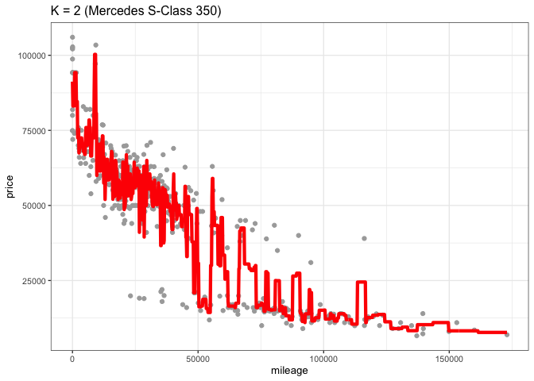

    ## [1] 11397.94

We get an RMSE of 11,397.94.

### What about K = 5?

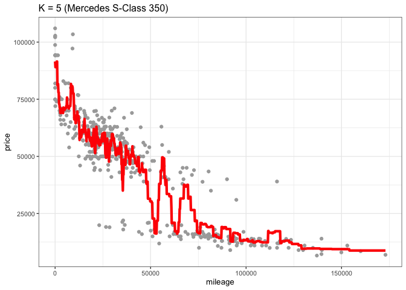

    ## [1] 9894.631

Our RMSE falls to 9894.631.

### K=10

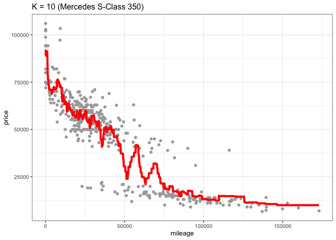

    ## [1] 9906.748

Our RMSE rises slightly to 9906.748.

### K=20

    ## [1] 9448.855

At K = 20, our RMSE is at 9448.855.

And just to see what happens when we have an extremely large K value,
let us see the RMSE for 150.

### K=150

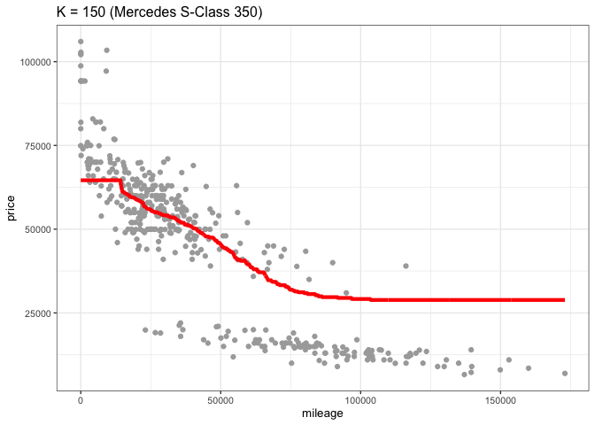

    ## [1] 12231.35

It rises to 14902.3. Not a good sign.

Let us look at how our RMSE behaves for different values of K and
identify where it bottoms out (since K = 150 was clearly not it).

### What is our RMSE against different values of K?

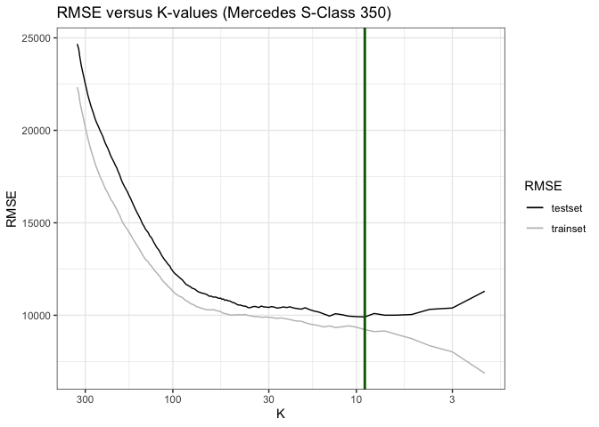

For K-values ranging from 2 to 332, the RMSE starts around 10,000 and
goes up beyond 20,000. We find that the RMSE is minimized around 10,000
for a K-value between ~40 and ~10. For the purpose of this exercise, we
can take the optimal K-value as 15 since it is less wiggly (lower
variance) than that of lower K-values and still maintains a reatively
low RMSE of around 9,500.

### K-nearest neighbors: at the optimal K = 15

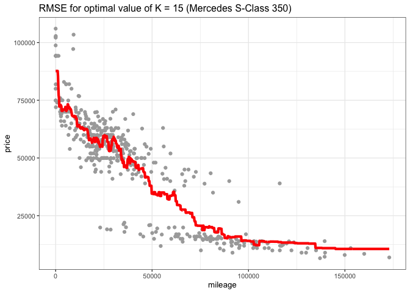

    ## [1] 10064.79

### Now for S-Class 65 AMG

We can repeat our exercise of seeing how the model fits the training set
and performance of our predictions for a few values of K.

### K = 2

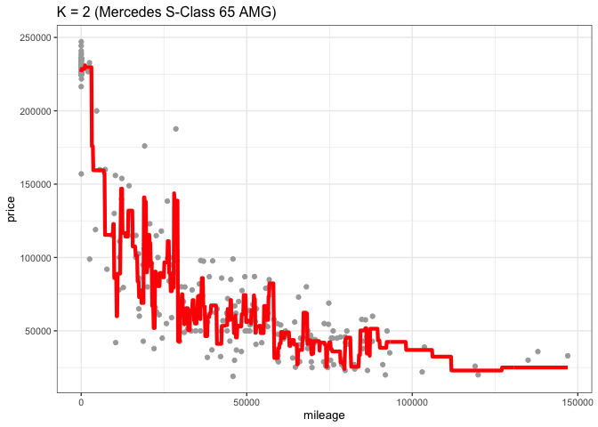

    ## [1] 26877.91

We have an RMSE of nearly 29,000.

### How about K = 5?

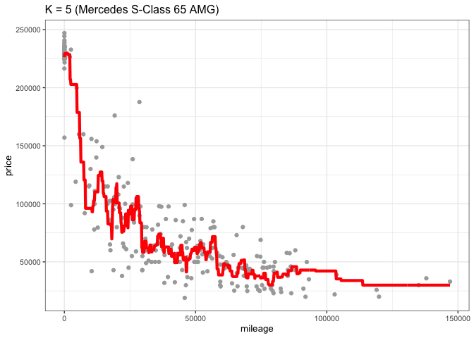

    ## [1] 22065.76

Our RMSE falls to 26,420.

Let us see K = 10.

### K=10

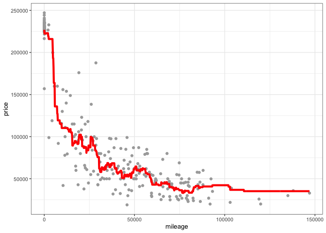

    ## [1] 21862.84

### K = 20

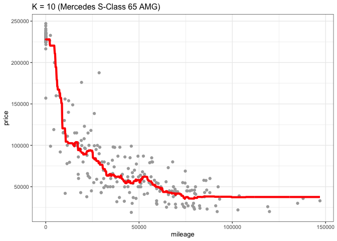

    ## [1] 23563.03

Our RMSE is now about 25,000. Let us plot RMSE against different values
of K now.

### What is our RMSE against different values of K?

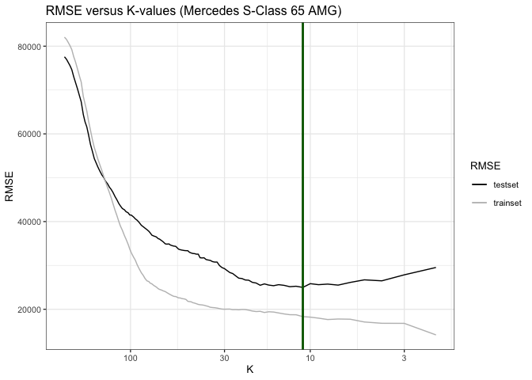

For K-values ranging from 2 to 233, the RMSE starts around 30,000 and
goes up beyond 80,000. We find that the RMSE is minimized around 20,000
for a K-value between ~30 and ~20. For the purpose of this exercise, we
can take the optimal K-value as 9 since it is less wiggly (lower
variance) than that of lower K-values and still maintains a reatively
low RMSE of around 20,000.

### K-nearest neighbors: at the optimal K = 9

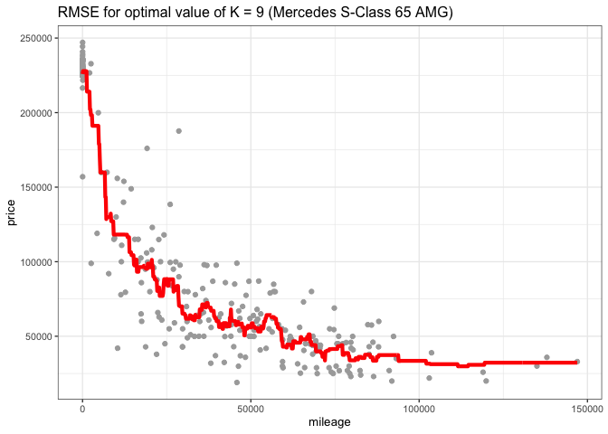

    ## [1] 25605.95

We can see that the trim level of 65 AMG has an optimal K of 9. On the
other hand, the 350 trim has an optimal k value of 15. When we have a
higher k-value, we will tend to have a higher bias but lower variance.
Prices for cars with the 350 trim level vary less than that of cars with
the 65 AMG level. Cars with the 350 trim are mostly clustered between 0
to 50000 miles for a price range between $50,000 and $75,000 or below
$25,000 when offering mileage between 50,000 and 1,50,000 miles. Here, a
higher k-value would be reasonable since we have lower variance within
the dataset to be concerned about.

With a lower k-value, we risk having a higher variance but lower bias.
Cars with a 65 AMG level trim are more scattered, and therefore, we will
need a lower k-value to make more accurate price predictions.

While both trim levels are marketed as “luxury”, the S65 AMG has
features of a sports car and thus, will call a varying price on the
second-hand market. Its price will hinge upon additional features and
aspects such as year of production. Its working condition will be more
critically evaluated than that of a standard sedan. In this case, that
is the S350. S65 AMGs with 0 mileage cost between $20,000 to $2,50,000
while S350 only vary between $75,0000 and $100,000 (approximately) for
the same. It may also explain why we have a smaller set of observations
for the S65 since there potentially would be a smaller market for a
sports car than that for a sedan.

When we check the RMSE for both datasets through K-cross validation with
five folds, we can also see that the RMSE for S65 AMG is higher than
that of S350. The mean RMSE for S350 is 11,353 and that for S65 AMG is
35,438.

### Mean RMSE for S350

    ##    Min. 1st Qu.  Median    Mean 3rd Qu.    Max. 
    ##   10488   11076   11292   11315   11856   11865

    ## [1] 11315.34

    ## [1] 258.4822

### Mean RMSE for S65 AMG

    ##    Min. 1st Qu.  Median    Mean 3rd Qu.    Max. 
    ##   29352   31949   35699   35550   39207   41544
