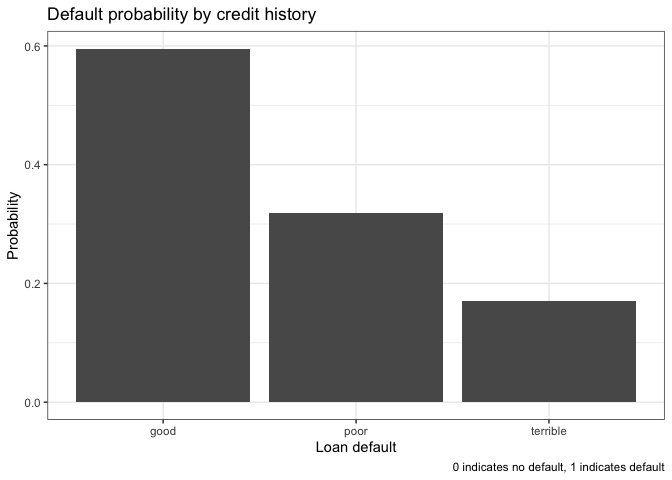

# Homework 2
## ECO 395M: Data Mining and Statistical Learning 

## Soo Jee Choi, Annie Nguyen, and Tarini Sudhakar

### 2023-02-22

## 1) Saratoga house prices

To know the appropriate taxation levels, we first need to ensure that we
get our predicted market values of properties right. We conduct a “horse
race” that is, compare the performance of two models on the Saratoga
house prices. The dataset contains information such as lot size, age,
bedrooms and more about 1728 houses in Saratoga, New York from 2006.

We evaluate two models for predicting house prices: a linear model, and
a K-nearest neighbour (KNN) regression model. For both models, we split
our data into training and test sets with an 80-20 ratio. To test
models, we compare their Root Mean Squared Error (RMSE). RMSE measures
how large are the errors made by the model on the data, on average.
Higher RMSE indicates poor predictive performance. There is further
detail in the Appendices on the dataset and the models.

There are two types of RMSE that we will looking at here: in-sample and
out-of-sample. In-sample RMSE is when we test the model on the data it
has already been trained on. Out-of-sample RMSE is when we run the model
on test data that we split from the original dataset earlier.
Out-of-sample RMSE is crucial because it tells us how well the model
will perform on data it has not seen before.

## Linear Model

    ## [1] 57443.03

    ## [1] 56681

When we evaluate a single linear model train/test split, we get an
in-sample RMSE of ~55k and an out-of-sample RMSE of ~60k.

    ##   result 
    ## 62816.14

The average out-of-sample RMSE for 25 random linear model train/test
splits is ~60k

## KNN Model

    ## [1] 61373.36

    ## [1] 117127.4

In a single KNN regression model train/test split, we get an in-sample
RMSE of ~60k and an out-of-sample RMSE of 120k.

    ##   result 
    ## 118259.5

The average out-of-sample RMSE for 25 random KNN regression train/test
splits is ~114k.

## What does it mean for predicting house prices?

Overall, the linear model is the most well-suited for predicting house
prices.

We find that in a single linear model train/test split, we get an
in-sample RMSE of ~55k and an out-of-sample RMSE of ~60k. We standardize
our variables before applying KNN and find using a single KNN regression
model train/test split, results in an in-sample RMSE of ~60k and an
out-of-sample RMSE of ~120k. We can see that in a single train/test
split, the in-sample RMSE of both models are similar at approximately
50k and 60k for the Linear and KNN models, respectively.

However, the out-of-sample RMSE of the models were notably different at
approximately at ~60k and ~114k. So while both models performed
similarly using in-sample data, the linear model performed much better
using the out-of-sample/testing data.

When measuring out-of-sample performance, there is random variation due
to the particular choice of data points that end up in the train/test
split sample. To address this issue, we average 25 different/random
train/test split estimates of out-of-sample RMSE. By doing this, we see
that the average out-of-sample RMSE of 25 random linear model train/test
splits is ~60k, and the average out-of-sample RMSE of 25 random KNN
regression train/test splits is ~114k. These results confirm our
findings from the single train/test splits. So, we conclude that the
linear regression model is better at achieving lower out-of-sample
mean-squared error than the KNN model.

Note that this analysis relied on the best models we could produce using
the data. There may exist a KNN model that outperforms the linear model
we produced. But looking at the out-of-sample RMSE using single and
average RMSE, that seems unlikely to be the case.

## Appendix

### Appendix 1: Saratoga house prices dataset

The dataset contains 1728 observations with 16 variables.

    ##  [1] "age"             "bathrooms"       "bedrooms"        "centralAir"     
    ##  [5] "fireplaces"      "fuel"            "heating"         "landValue"      
    ##  [9] "livingArea"      "lotSize"         "newConstruction" "pctCollege"     
    ## [13] "price"           "rooms"           "sewer"           "waterfront"

### Appendix 2: Linear Model

The linear model predicts price based on the following variables, and
transformations and interactions between some of those variables.

    ## 
    ## Call:
    ## lm(formula = price ~ lotSize + poly(age, 3) + poly(landValue, 
    ##     3) + livingArea + pctCollege:age + bedrooms + bathrooms + 
    ##     rooms + heating + fuel + sewer + waterfront + newConstruction + 
    ##     centralAir, data = saratoga_train)
    ## 
    ## Residuals:
    ##     Min      1Q  Median      3Q     Max 
    ## -241815  -33782   -4236   27922  463096 
    ## 
    ## Coefficients:
    ##                          Estimate Std. Error t value Pr(>|t|)    
    ## (Intercept)             1.293e+05  2.037e+04   6.348 2.96e-10 ***
    ## lotSize                 8.264e+03  2.946e+03   2.805  0.00510 ** 
    ## poly(age, 3)1          -4.873e+05  2.406e+05  -2.025  0.04304 *  
    ## poly(age, 3)2           2.594e+05  6.611e+04   3.924 9.14e-05 ***
    ## poly(age, 3)3          -3.095e+05  6.149e+04  -5.032 5.49e-07 ***
    ## poly(landValue, 3)1     1.189e+06  6.991e+04  17.010  < 2e-16 ***
    ## poly(landValue, 3)2    -1.219e+05  6.248e+04  -1.951  0.05127 .  
    ## poly(landValue, 3)3     9.798e+04  6.134e+04   1.597  0.11043    
    ## livingArea              6.603e+01  5.080e+00  12.997  < 2e-16 ***
    ## bedrooms               -6.861e+03  2.873e+03  -2.388  0.01708 *  
    ## bathrooms               2.055e+04  3.841e+03   5.349 1.03e-07 ***
    ## rooms                   3.074e+03  1.071e+03   2.869  0.00419 ** 
    ## heatinghot water/steam -6.240e+03  4.692e+03  -1.330  0.18381    
    ## heatingelectric         7.169e+02  1.446e+04   0.050  0.96046    
    ## fuelelectric           -7.559e+03  1.417e+04  -0.533  0.59385    
    ## fueloil                -2.340e+03  5.618e+03  -0.417  0.67707    
    ## sewerpublic/commercial -4.693e+03  4.115e+03  -1.140  0.25429    
    ## sewernone              -1.329e+04  1.865e+04  -0.713  0.47611    
    ## waterfrontNo           -1.229e+05  1.591e+04  -7.721 2.22e-14 ***
    ## newConstructionNo       5.295e+04  8.205e+03   6.454 1.51e-10 ***
    ## centralAirNo           -1.031e+04  3.807e+03  -2.707  0.00687 ** 
    ## pctCollege:age          5.477e+00  3.957e+00   1.384  0.16658    
    ## ---
    ## Signif. codes:  0 '***' 0.001 '**' 0.01 '*' 0.05 '.' 0.1 ' ' 1
    ## 
    ## Residual standard error: 57630 on 1360 degrees of freedom
    ## Multiple R-squared:  0.665,  Adjusted R-squared:  0.6599 
    ## F-statistic: 128.6 on 21 and 1360 DF,  p-value: < 2.2e-16

### Appendix 3: KNN Model

The KNN model predicts a particular house price by using the average of
K-nearest prices. For example, if K = 10, then the model will estimate a
house price by using the average of its 10 closest data points.

To determine the optimal value of k in the KNN model, we perform 25
separate train/test split RMSE analysis using for each k values. We then
calculate the mean RMSE of the 25 samples and then compare the results
across the different k value samples. Specifically, we test the values
K=2, 3, 5, 10, 15, 20, 25, 35, 40, 50 and find ~130k, ~128k, ~126k,
~123k, ~121k, ~119k, ~118k, ~114k, ~120k, ~123k as the RMSE values,
respectively. We find that K=35 resulted in the lowest RMSE for our
model.

## 2) Classification and retrospective sampling

In this part of the assignment, we want to be able to predict whether a
person will default on their loan, based on factors such as credit
history. What is unique about this problem is its dataset. Since the
data available on loan defaults is small, the German bank decided to
oversample its defaults by matching each default to a similar set of
loans in the overall bank portfolio. Is this dataset appropriate for the
model that we wish to build? Can it predict which of the bank’s clients
will default on a loan?

What did we do to assess the data at hand? First, we wanted to see the
default probability by credit history. Our results show that individuals
with a good credit history have the highest probability of defaulting on
a loan. Whereas, people with terrible credit history have the lowest.
This seems counter intuitive since credit history indicates how well a
borrower has repayed their debts. A good credit history should have a
lower default probability.

Nevertheless, if we build a logistic regression model around this
dataset, regressing Default on duration, amount, installment, age,
credit history, purpose, and foreign, we get the following results.

    ## 
    ## Call:
    ## glm(formula = Default ~ duration + amount + installment + age + 
    ##     history + purpose + foreign, family = "binomial", data = credit)
    ## 
    ## Deviance Residuals: 
    ##     Min       1Q   Median       3Q      Max  
    ## -2.3464  -0.8050  -0.5751   1.0250   2.4767  
    ## 
    ## Coefficients:
    ##                       Estimate Std. Error z value Pr(>|z|)    
    ## (Intercept)         -7.075e-01  4.726e-01  -1.497  0.13435    
    ## duration             2.526e-02  8.100e-03   3.118  0.00182 ** 
    ## amount               9.596e-05  3.650e-05   2.629  0.00856 ** 
    ## installment          2.216e-01  7.626e-02   2.906  0.00366 ** 
    ## age                 -2.018e-02  7.224e-03  -2.794  0.00521 ** 
    ## historypoor         -1.108e+00  2.473e-01  -4.479 7.51e-06 ***
    ## historyterrible     -1.885e+00  2.822e-01  -6.679 2.41e-11 ***
    ## purposeedu           7.248e-01  3.707e-01   1.955  0.05058 .  
    ## purposegoods/repair  1.049e-01  2.573e-01   0.408  0.68346    
    ## purposenewcar        8.545e-01  2.773e-01   3.081  0.00206 ** 
    ## purposeusedcar      -7.959e-01  3.598e-01  -2.212  0.02694 *  
    ## foreigngerman       -1.265e+00  5.773e-01  -2.191  0.02849 *  
    ## ---
    ## Signif. codes:  0 '***' 0.001 '**' 0.01 '*' 0.05 '.' 0.1 ' ' 1
    ## 
    ## (Dispersion parameter for binomial family taken to be 1)
    ## 
    ##     Null deviance: 1221.7  on 999  degrees of freedom
    ## Residual deviance: 1070.0  on 988  degrees of freedom
    ## AIC: 1094
    ## 
    ## Number of Fisher Scoring iterations: 4

    ##         (Intercept)            duration              amount         installment 
    ##               -0.71                0.03                0.00                0.22 
    ##                 age         historypoor     historyterrible          purposeedu 
    ##               -0.02               -1.11               -1.88                0.72 
    ## purposegoods/repair       purposenewcar      purposeusedcar       foreigngerman 
    ##                0.10                0.85               -0.80               -1.26

If someone has a poor credit history, then the odds of them defaulting
on a loan is multiplied by *e*−1.11 ≈ 0.33. Similarly, if
someone has a terrible credit history, then the odds of them defaulting
on a loan is multiplied by *e*−1.88 ≈ 0.17. These results
still are the opposite of what I expected. Odds of someone defaulting on
a loan should rise if they have a poor or terrible credit history.

### What is the bigger problem at play?

Since the bank decided to conduct a case-control design, it used
existing data to predict whether certain people will default on a loan,
given other features. Since defaults are rare, the bank matched each
default with similar sets of loans that had not defaulted. This means
that they oversampled defaults relative to a random sample of loans in
the bank’s overall portfolio.

Oversampling is used to correct what is known as “class imbalance”. In
this case, it refers to the low number of defaults in the bank
portfolio. But this method can result in biased estimates if the same
data point is used multiple times, leading to overfitting. Here, since
we matched each default with a similar set of non-defaulted loans, we
ended up with a data distribution that may not appropriately represent
reality. We also do not have enough information on what parameters the
bank used to match the loans. Together, this resulted in unreliable
estimates since we can no longer draw reasonable conclusions about how a
particular credit history may affect the default probability of an
individual. This is why we are getting a negative coefficient for poor
and terrible credit history while predicting loan defaults.

### How do we go ahead from here?

This dataset is not appropriate for building a predictive model of
defaults. The case-control sample places a defaulted loan in a bag of
loans of similar value. But we do not know if the bank considered other
features such as credit history, age, and savings. It is also not
representative of the true data distribution. This means that we cannot
draw useful conclusions about someone particular to their credit history
and classify them into “high” versus “low” probability of default.

Instead of following this methodology, the bank can accord weights to
the default loans in the sample. This will allow for their adequate
representation in the sample that the bank has without diluting the
validity of the estimates.

## 3) Children and hotel reservations

In this section, we will focus on building a predictive model for
whether a booking at a hotel will have children on it. Oftentimes,
parents fail to include their children when making reservations.
Although this piece of information may seem trivial, being able to
anticipate guests’ needs are very important for hotel staff, so it is
essential for management to know how many children are staying to better
cater to families’ needs and to keep supplies/inventory well-stocked.

Therefore, in this portion, we will focus on predicting the `children`
variable.

### Model Building

Using only the data in `hotels_dev.csv`, we will compare the
out-of-sample performance of the following:

1.  baseline 1: a small model that uses only the `market_segment`,
    `adults`, `customer_type`, and `is_repeated_guest` variables as
    features.
2.  baseline 2: a big model that uses all the possible predictors except
    the `arrival_date` variable (main effects only)
3.  the best linear model you can build, including any engineered
    features that you can think of that improve the performance
    (interactions, features derived from time stamps, etc)

#### Baseline Model 1:

    ##            acc ppv  rmse_    auc
    ## Metrics 0.9233 NaN 3.0913 0.6757

After fitting the baseline model 1 to the training set and assessing
out-of-sample accuracy, we see this model predicts with about 91%
accuracy, but the area under the curve (AUC) is quite low. Although we
would not consider “bad” model performance, the low AUC indicates that
this is not the best model.

#### Baseline Model 2:

    ##            acc    ppv  rmse_    auc
    ## Metrics 0.9382 0.7055 4.0053 0.8707

From the out-of-sample performance measures, we see that this model has
both higher accuracy and a significantly higher AUC. Although the RMSE
is higher for baseline model 2, I would still choose baseline model 2
over model 1 because both accuracy and AUC are improved. Furthermore, I
have also calculated the value for positive predictive values (PPV),
which are the proportion of true positives. In this case, the value for
ppv is approximately 0.7, which means that, of the positive values
predicted, about 70% are true positives.

#### Testing Best Linear Model:

In finding the “best” linear model, we have two different approaches.
First, we manually build a linear model by adding variables and testing
out-of-sample performance. Then, we built a model using forward
selection. We, again, use out-of-sample performance to assess the
models.

    ##            acc    ppv  rmse_    auc
    ## Metrics 0.9382 0.6903 0.2292 0.8688

In this first linear model, we include all variables (except
`arrival_date`) as well as a few interaction terms
(`adults:stays_in_weekend_nights`, `adults:stays_in_week_nights`,
`stays_in_weekend_nights:stays_in_week_nights`). When comparing this
linear model to Baseline Model 2, we see that the linear model has
similar accuracy and AUC values as Model 2, but the RMSE value is
significantly lower. This may have to do with differences between linear
and logistic models. When we look at the PPV value, we see that the PPV
for this linear model is slightly lower than the PPV in model 2.

Although the out-of-sample performance values may suggest this is also a
good model, the logistic model is still preferred when predicting binary
outcomes.

In the second linear model, we use forward selection to find a strong
linear model, which gives us a regression where we regress `children`
on: `market_segment`, `customer_type`, `is_repeated_guest`, `adults`,
`market_segment:adults`, `customer_type:adults`, and
`market_segment:is_repeated_guest`

    ##            acc ppv  rmse_    auc
    ## Metrics 0.9233 NaN 0.2621 0.6848

In the second linear model, accuracy and RMSE is comparable to the first
linear model, but AUC drops significantly. Between the two linear
models, the first linear model still outperforms the second.

Although the first linear model has similar accuracy, PPV, and AUC
values, the logistic model is still preferred. Therefore, Baseline Model
2 is still the best model.

### Model Validation: Step 1

The following is an ROC plot for Baseline Model 2, using the
`hotels_val.csv` data.

An ROC plots TPR vs. FPR. TPR is another name for sensitivity, while FPR
is defined as 1-specificity, which explains why the numbers on the
x-axis are flipped with 1 on the left and 0 on the right.

### Model Validation: Step 2

In this step, we create 20 folds of `hotels_val`, so each fold will have
about 250 bookings. We conduct 20-fold cross-validation on Baseline
Model 2.

For each fold, we will: 1. Predict whether each booking will have
children on it 2. Sum up predicted probabilities for all bookings in the
fold, giving an estimate of the expected number of bookings with
children 3. Compare the “expected” number of bookings with children
vs. the actual number of bookings with children in that fold

**The results for each fold is as follows:**

    ##              acc    ppv   rmse_    auc pred_children actual_children
    ## Metrics   0.9360 0.5714  7.5286 0.6112             7              17
    ## Metrics1  0.9280 0.6667  6.3321 0.6363             9              21
    ## Metrics2  0.9560 0.8750  5.3427 0.7037             8              17
    ## Metrics3  0.9280 0.6667  5.2280 0.5957             6              20
    ## Metrics4  0.9240 0.8333 91.0308 0.6065             6              23
    ## Metrics5  0.9400 0.3636  5.9665 0.6520            11              12
    ## Metrics6  0.9440 0.8571  8.3685 0.6557             7              19
    ## Metrics7  0.9320 0.7500  5.7253 0.6385             8              21
    ## Metrics8  0.9440 0.7000 11.3796 0.6880            10              18
    ## Metrics9  0.9080 0.6154  5.1458 0.6427            13              26
    ## Metrics10 0.9320 0.7692  5.6898 0.7017            13              24
    ## Metrics11 0.8720 0.5714  8.1846 0.6038            14              34
    ## Metrics12 0.9440 0.8000  5.2494 0.7543            15              23
    ## Metrics13 0.9400 0.6667  6.2247 0.7019            12              19
    ## Metrics14 0.9360 0.5556  7.3147 0.6385             9              17
    ## Metrics15 0.9240 0.5556  5.7867 0.6163             9              20
    ## Metrics16 0.9400 0.7500  4.5533 0.7077            12              21
    ## Metrics17 0.9360 0.5455  7.7718 0.6657            11              17
    ## Metrics18 0.9400 0.6429  4.8244 0.7260            14              19
    ## Metrics19 0.9438 0.5000  5.3276 0.6008             6              14

**Average of performance metrics across 20 folds:**

    ##       acc      ppv    rmse_     auc pred_children actual_children
    ## 1 0.93239 0.662805 10.64874 0.65735            10            20.1

From the performance metrics, we see that accuracy stays above 90% on
average, but PPV and AUC is relatively low. This means that this model
could use further improvement to make better predictions.
