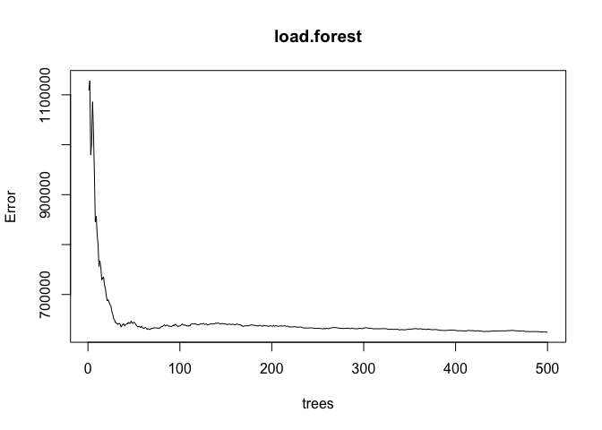
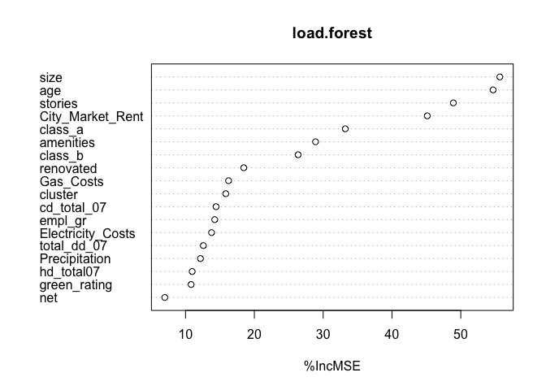
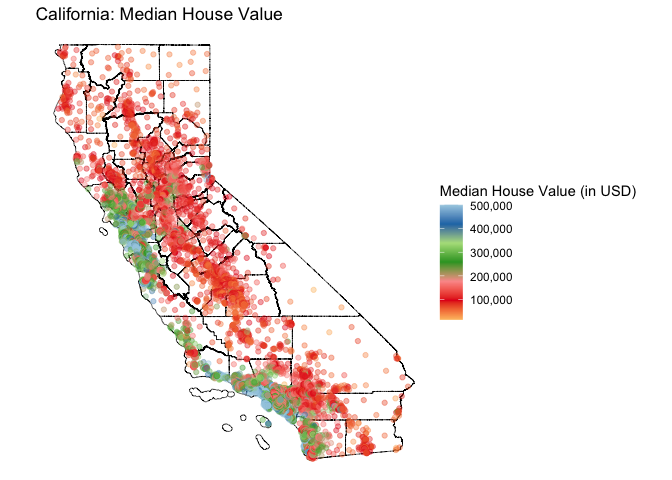

## What causes what?

### ***1. Why can’t I just get data from a few different cities and run the regression of “Crime” on “Police” to understand how more cops in the streets affect crime? (“Crime” refers to some measure of crime rate and “Police” measures the number of cops in a city.)***

### High-crime cities have an incentive to hire more cops in an effort to lower crime rate. So it is likely the case that cities with high crime have more cops. That is, high crime rate is likely correlated with higher number of city cops. However, to isolate the causal effect of the number of cops on crime rate, one cannot simply run a regression of “Crime” on “Police” using data from a few cities. First, to find any causal effect, one needs to establish a large, robust data set to run analysis on. This is because we often get bias estimates using a smaller number of data sets. Second, there are other variables, such as region and area income, that have an effect on “Crime” that the regression would not be controlling for. This would cause the results to have omitted variable bias.

### ***2. How were the researchers from UPenn able to isolate this effect? Briefly describe their approach and discuss their result in “Table 2” from the researchers’ paper.***

### The podcast discussed a clever way researchers looked into finding the causal effect of “Crime” on “Police” in Washington D.C. Washington D.C., being the nation’s capital, has a terrorism alert system. When the terror alert level goes to orange, extra police are put on the Mall and other parts of Washington, irrespective of the day’s crime rate. So researchers analyzed orange alert days (when there are extra police on the streets for reasons unrelated to street crime), to examine what happens to street crime. The researchers also looked at ridership levels on the Metro system on those particular days, as it is possible people were less likely to travel and tourists were less likely to visit Washington D.C. on Orange Alert days. However, Metro ridership levels actually were not diminished on high-terror days, so they suggested the number of crime-victims was largely unchanged.

### As seen in Table 2 Column 1, the researchers found that street crime went down on days when there were extra-police (for days when there was an orange alert level- i.e. reasons unrelated to street crime). The estimated coefficient of “High Alert” was negative (-7.316) and statistically significant at 5%. Column 2 additionally controls for metro midday ridership.”High Alert” had a negative estimated coefficient (-6.046) and “Log(midday ridership)” had a positive estimated coefficient (17.341). Both estimates were statistically significant at 5% and 1%, respectively.

### ***3. Why did they have to control for Metro ridership? What was that trying to capture?***

### As stated in question 2, Metro ridership was added to the model to capture any potential differences in the number of potential “crime-victims” on alert level orange days. If the number of regular civilians (i.e. potential “crime-victims”) - here being measured by Metro ridership - are notably different/lower on alert level Orange Days, then differences in crime rate may not only be attributed to changes in police presence, but also to changes in the number of civilians as well. However, the results in Table 2 show that that was not the case, and suggest the number of victims was largely unchanged.

### ***4. Can you describe the model being estimated in the first column of “Table 4”? What is the conclusion?***

### Table 4 shows a model where the dependent variable is the daily total number of crimes in D.C. and the independent variables are a “High Alert” “District 1” interaction term, “High Alert” “Other Districts” interaction term, and a “Log(midday ridership)” term. “District 1” refers to a dummy variable associated with crime incidents in the first police district area (which is the closest police district to the United States Capitol). Interactions terms are used when the effect of an independent variable on a dependent variable is context-specific. This model has separate “High Alert” interaction terms for “District 1” and “Other Districts”. This allows the researchers to compare the effect of “High Alert”x”District 1” and “High Alert”x”Other Districts”. And we do see evidence there is a difference - the estimated coefficients for “High Alert”x”District 1” and “High Alert”x”Other Districts” were -2.621 and -.571, respectively. We see that daily total number of crimes decreased more in District 1 on High Alert days than in Other Districts on High Alert days. Further, the results were significant at 1% for the “High Alert”x”District 1” term and not significant for the “High Alert”x”Other Districts” term. And as seen in Table 2, we see Log(midday ridership) is positive and statistically significant, indicating the number of Metro riders/potential crime victims were not diminished on high-terror days.

## Tree Modeling: Dengue Cases

Our aim is to use CART, random forests, and gradient-boosted trees to
predict dengue cases in San Juan, Puerto Rico and Iquitos, Peru using
weekly data from 1990 to 2010. Our data set contains the six feature
variables explicitly listed (total\_cases, city, season,
specific\_humidity, tdtr\_k, precipitation\_amt) in addition to the
variables measuring average temperature and dew point temperature in
kelvin (i.e. avg\_temp\_k and dew\_point\_temp\_k, respectively). The
city and season variables are set as factors as we want the analysis to
treat the variable values as a category.

The data set is split into training and testing sets. We build our basic
CART model with the control cp = 0.00001 and the the five feature
variables explicitly listed to predict the number of dengue cases (city,
season, specific\_humidity, tdtr\_k, precipitation\_amt). With the
option cp = 0.00001, the CART model “grows big” by splitting a node if
the split improves the deviance by a factor of 0.00001 (0.001%). Then
the tree is pruned to the smallest tree whose CV error is within 1
standard deviation of the minimum.

We consider combinations of two additional features (average temperature
and dew point temperature in kelvin) to find the best CART model. We
consider four models: the basic CART model (the model consisting of the
five explicitly listed independent variables), the basic CART model with
the avg\_temp\_k variable, the basic CART model with the
dew\_point\_temp\_k variable, and the basic CART model with both the
avg\_temp\_k and dew\_point\_temp\_k variables. We evaluate the quality
of the models by examining the average in-sample RMSE for 25 model
train/test splits for each model. We find that the basic CART model with
both the avg\_temp\_k and dew\_point\_temp\_k variables is the best CART
model with an average RMSE of 37.774. The the basic CART model, the
basic CART model with the avg\_temp\_k variable, and the basic CART
model with the dew\_point\_temp\_k variables had average RMSE values of
40.38013, 39.82441, and 40.1219, respectively.

    ## Using parallel package.
    ##   * Set seed with set.rseed().
    ##   * Disable this message with options(`mosaic:parallelMessage` = FALSE)

    ##  result 
    ## 40.1716

    ## Using parallel package.
    ##   * Set seed with set.rseed().
    ##   * Disable this message with options(`mosaic:parallelMessage` = FALSE)

    ##   result 
    ## 39.96102

    ## Using parallel package.
    ##   * Set seed with set.rseed().
    ##   * Disable this message with options(`mosaic:parallelMessage` = FALSE)

    ##   result 
    ## 40.46478

    ## Using parallel package.
    ##   * Set seed with set.rseed().
    ##   * Disable this message with options(`mosaic:parallelMessage` = FALSE)

    ##  result 
    ## 40.0437

For Random Forests, we again consider combinations of two additional
features (average temperature and dew point temperature in kelvin) to
find the best Random Forests model. We consider the following four
models: the basic model (the model consisting of the five explicitly
listed independent variables), the basic model with the avg\_temp\_k
variable, the basic model with the dew\_point\_temp\_k variable, and the
basic model with both the avg\_temp\_k and dew\_point\_temp\_k
variables. The quality of the models are evaluated by examining the
average in-sample RMSE for 25 model train/test splits for each model.

Similar to the best CART model, we find that the basic Random Forest
model with both the avg\_temp\_k and dew\_point\_temp\_k variables is
the best model with an average RMSE of 21.48982. The the basic Random
Forest model, the basic Random Forest model with the avg\_temp\_k
variable, and the basic Random Forest model with the dew\_point\_temp\_k
variables had average RMSE values of 34.70102, 22.35256, and 22.8386,
respectively.

    ## Using parallel package.
    ##   * Set seed with set.rseed().
    ##   * Disable this message with options(`mosaic:parallelMessage` = FALSE)

    ##   result 
    ## 34.13206

    ## Using parallel package.
    ##   * Set seed with set.rseed().
    ##   * Disable this message with options(`mosaic:parallelMessage` = FALSE)

    ##   result 
    ## 22.36185

    ## Using parallel package.
    ##   * Set seed with set.rseed().
    ##   * Disable this message with options(`mosaic:parallelMessage` = FALSE)

    ##   result 
    ## 22.85227

    ## Using parallel package.
    ##   * Set seed with set.rseed().
    ##   * Disable this message with options(`mosaic:parallelMessage` = FALSE)

    ##   result 
    ## 21.00051

Finally, for the Gradient-Boosted Trees model we again consider
combinations of two additional features (average temperature and dew
point temperature in kelvin) to find the best Gradient-Boosted Trees
model. The model we used utilized the default Gaussian model). We
examine the four models we have been considering before (the basic
model, the basic model with the avg\_temp\_k variable, the basic model
with the dew\_point\_temp\_k variable, and the basic model with both the
avg\_temp\_k and dew\_point\_temp\_k variables). The quality of the
models are evaluated by examining the average in-sample RMSE for 25
model train/test splits for each model.

Similar to the best CART model and the best Random Forest model, we find
that the basic Gradient-Boosted Trees model with both the avg\_temp\_k
and dew\_point\_temp\_k variables is the best model with an average RMSE
of 17.46581. The the basic Gradient-Boosted Trees model, the basic
Gradient-Boosted Trees model with the avg\_temp\_k variable, and the
basic Gradient-Boosted Trees model with the dew\_point\_temp\_k
variables had average RMSE values of 20.83645, 19.07204, and 20.20074,
respectively.

    ##   result 
    ## 20.61769

    ##   result 
    ## 19.16376

    ##   result 
    ## 20.32638

    ##   result 
    ## 18.86185

We now use the best CART model, Random Forests model, and
Gradient-Boosted Trees model to predict the total number of dengue
cases. For all three models, we found that the best models, by measure
of in-sample RMSE, were the basic model with both the avg\_temp\_k and
dew\_point\_temp\_k variables. We compare the three models by using the
testing data as a final check to see which model performed the best.
Like with the previous model analysis, the quality of the models are
evaluated by examining the average of 25 model train/test splits for
each model. We find that the Random Forest model performed the best with
an out-of-sample RMSE of 39.64522. The CART model did second best with
an out-of-sample RMSE of 40.1887 and the Gradient-Boosted Trees model
did the worst with an out-of-sample RMSE of 41.38736.

    ##          cart  randomForest gradientBoost 
    ##      46.32565      47.86591      49.08355

Partial dependent plots shows the relationship between total cases and
an independent variable in our random forest model while taking account
of the joint effect of other features. In the specific\_humidity partial
dependent plot, we see that total cases slowly increases with specific
humidity, then increases slightly at 15 before shooting up around a
specific humidity of 19. The partial dependence plot of precipitation
amount shows a different picture - total cases initial takes a huge drop
and then rises up and down from 0-100 before slowing rising into a
plateau. The avg\_diurnal\_temp\_range partial dependent plot shows
total cases rapidly decreases, with a few small rises in the 0 to 5
avg\_diurnal\_temp\_range variable range. The partial dependent plots
for specific\_humidity, precipitation\_amt, and
avg\_diurnal\_temp\_range are presented below.

## Predictive Model Building: Green Certification

In this section we build a model to predict revenue per square foot per
calendar year. We will use the model to quantify the average change in
rental income per square foot associated with green certification.

Revenue is calculated by multiplying `Rent` with `lease_rate`. When
revenue is added into the data set, we drop `Rent` and `lease_rate` to
avoid collinearity. The variables we will be working with is as follows:

    ##   cluster   size empl_gr stories age renovated class_a class_b green_rating net
    ## 1       1 260300    2.22      14  16         0       1       0            1   0
    ## 2       1  67861    2.22       5  27         0       0       1            0   0
    ## 3       1 164848    2.22      13  36         1       0       1            0   0
    ## 4       1  93372    2.22      13  46         1       0       1            0   0
    ## 5       1 174307    2.22      16   5         0       1       0            0   0
    ## 6       1 231633    2.22      14  20         0       1       0            0   0
    ##   amenities cd_total_07 hd_total07 total_dd_07 Precipitation  Gas_Costs
    ## 1         1        4988         58        5046         42.57 0.01370000
    ## 2         1        4988         58        5046         42.57 0.01373149
    ## 3         1        4988         58        5046         42.57 0.01373149
    ## 4         0        4988         58        5046         42.57 0.01373149
    ## 5         1        4988         58        5046         42.57 0.01373149
    ## 6         1        4988         58        5046         42.57 0.01373149
    ##   Electricity_Costs City_Market_Rent  revenue
    ## 1        0.02900000            36.78 3523.998
    ## 2        0.02904455            36.78 2489.590
    ## 3        0.02904455            36.78 2962.591
    ## 4        0.02904455            36.78 3396.400
    ## 5        0.02904455            36.78 3929.840
    ## 6        0.02904455            36.78 4002.658

### Methods

#### Linear Regression

First, we will start with a linear regression model to use as a baseline
for comparison. This model includes the following variables:

    ##       (Intercept)           cluster              size           empl_gr 
    ##     -1.577240e+03      7.018042e-02      6.985197e-04      3.165761e+00 
    ##           stories               age         renovated           class_a 
    ##      1.346532e+00     -1.094747e+00      5.662217e+00      4.479750e+02 
    ##           class_b      green_rating               net         amenities 
    ##      2.736926e+02      1.682431e+02     -2.173081e+02      1.374960e+02 
    ##       cd_total_07        hd_total07       total_dd_07     Precipitation 
    ##      4.948040e-03      7.980021e-02                NA      2.546105e+00 
    ##         Gas_Costs Electricity_Costs  City_Market_Rent 
    ##     -1.892094e+04      1.955287e+04      9.738375e+01

    ## Warning in predict.lm(model, data): prediction from a rank-deficient fit may be
    ## misleading

    ## RMSE for linear regression:  904.6494

#### Regression with Step-wise Selection

Now, we will try step-wise selection to see if we can better refine the
model.

    ## RMSE for regression with step-wise selection:  884.7578

After applying step-wise selection, we see that the RMSE has been
reduced, which means that the model is better refined. However, this new
model has a total of 60 variables, which is not an efficient model to
make predictions. We will see if there are other methods to more
effectively predict revenue.

#### Tree Model

We will try comparing the tree model and the random forest model to the
baseline model to see which model is better at predicting revenue per
square foot.

    ## RMSE for tree:  782.013

#### Random Forest Model

    ## RMSE for random forest:  640.9333

Of the three models (baseline linear regression, tree, and random forest
models), we see that the random forest model’s RMSE is significantly
lower and is better at predicting revenue per square foot per year.
Therefore, we will use this model for prediction.

The above partial dependence plot shows the change in revenue per square
foot associated with green certification, holding all other features
constant. The slope for the graph is approximately 80, which shows that
the average change in rental income per square foot associated with
green certification is approximately $80.

### Conclusion

In this section, we went through a model-building process to find the
best model to predict revenue per square foot per calendar year. Of the
models that we have tested, we find that a random forest model does the
best job of making predictions in an efficient manner, giving us the
lowest RMSE value. We, then, used the model to find the average change
in income per square foot associated with green certification by
producing a partial dependence plot.

## Predictive Model Building: California Housing

In this part of the assignment, we want to predict the median house
value in California. We have 9 variables and 20640 observations. Since
we have total rooms and bedrooms for households in the tract, we
standardise these by households. You can find a description of the full
dataset in the appendix.

We use random forests to build our model (see appendix for its superior
performance against linear model, K-nearest neighbours, and a single
decision tree). What does random forests mean? Imagine an upside-down
tree. Trees involves sequential mini-decisions that result in a choice
or prediction. Random forests involve the creation of a large number of
these decision trees, each of which is trained on a different subset of
the available data. The algorithm randomly selects a subset of features
to use for each tree, which prevents overfitting.

Once the decision trees are trained, they can be used to make
predictions on new data. Random forests combines the predictions from
all of the decision trees to arrive at a final prediction.

We first plot median house values on the map of California. We can see
that the most highest median house value is clustered around the Bay
Area and Los Angeles in California. This makes sense given that these
are the technology and film industry hubs respectively, and there is
high demand and limited supply of housing.

    CAhousing <- read_csv("CAhousing.csv")

    ## Rows: 20640 Columns: 9
    ## ── Column specification ────────────────────────────────────────────────────────
    ## Delimiter: ","
    ## dbl (9): longitude, latitude, housingMedianAge, totalRooms, totalBedrooms, p...
    ## 
    ## ℹ Use `spec()` to retrieve the full column specification for this data.
    ## ℹ Specify the column types or set `show_col_types = FALSE` to quiet this message.

    head(CAhousing)

    ## # A tibble: 6 × 9
    ##   longitude latitude housingMe…¹ total…² total…³ popul…⁴ house…⁵ media…⁶ media…⁷
    ##       <dbl>    <dbl>       <dbl>   <dbl>   <dbl>   <dbl>   <dbl>   <dbl>   <dbl>
    ## 1     -122.     37.9          41     880     129     322     126    8.33  452600
    ## 2     -122.     37.9          21    7099    1106    2401    1138    8.30  358500
    ## 3     -122.     37.8          52    1467     190     496     177    7.26  352100
    ## 4     -122.     37.8          52    1274     235     558     219    5.64  341300
    ## 5     -122.     37.8          52    1627     280     565     259    3.85  342200
    ## 6     -122.     37.8          52     919     213     413     193    4.04  269700
    ## # … with abbreviated variable names ¹​housingMedianAge, ²​totalRooms,
    ## #   ³​totalBedrooms, ⁴​population, ⁵​households, ⁶​medianIncome, ⁷​medianHouseValue

    #Standardise variables 
    CAhousing <- CAhousing %>%
      mutate(avgRooms = totalRooms/households,
             avgBedrooms = totalBedrooms/households)

    CAhousing = CAhousing[,-c(4,5)] 

    #Creating the base map 
    ca_df <- tigris::counties("CA")

    ## Retrieving data for the year 2021

    ##   |                                                                              |                                                                      |   0%  |                                                                              |                                                                      |   1%  |                                                                              |=                                                                     |   1%  |                                                                              |=                                                                     |   2%  |                                                                              |==                                                                    |   2%  |                                                                              |==                                                                    |   3%  |                                                                              |==                                                                    |   4%  |                                                                              |===                                                                   |   4%  |                                                                              |===                                                                   |   5%  |                                                                              |====                                                                  |   5%  |                                                                              |====                                                                  |   6%  |                                                                              |=====                                                                 |   6%  |                                                                              |=====                                                                 |   7%  |                                                                              |=====                                                                 |   8%  |                                                                              |======                                                                |   8%  |                                                                              |======                                                                |   9%  |                                                                              |=======                                                               |   9%  |                                                                              |=======                                                               |  10%  |                                                                              |=======                                                               |  11%  |                                                                              |========                                                              |  11%  |                                                                              |========                                                              |  12%  |                                                                              |=========                                                             |  12%  |                                                                              |=========                                                             |  13%  |                                                                              |=========                                                             |  14%  |                                                                              |==========                                                            |  14%  |                                                                              |==========                                                            |  15%  |                                                                              |===========                                                           |  15%  |                                                                              |===========                                                           |  16%  |                                                                              |============                                                          |  16%  |                                                                              |============                                                          |  17%  |                                                                              |============                                                          |  18%  |                                                                              |=============                                                         |  18%  |                                                                              |=============                                                         |  19%  |                                                                              |==============                                                        |  19%  |                                                                              |==============                                                        |  20%  |                                                                              |==============                                                        |  21%  |                                                                              |===============                                                       |  21%  |                                                                              |===============                                                       |  22%  |                                                                              |================                                                      |  22%  |                                                                              |================                                                      |  23%  |                                                                              |================                                                      |  24%  |                                                                              |=================                                                     |  24%  |                                                                              |=================                                                     |  25%  |                                                                              |==================                                                    |  25%  |                                                                              |==================                                                    |  26%  |                                                                              |===================                                                   |  26%  |                                                                              |===================                                                   |  27%  |                                                                              |===================                                                   |  28%  |                                                                              |====================                                                  |  28%  |                                                                              |====================                                                  |  29%  |                                                                              |=====================                                                 |  29%  |                                                                              |=====================                                                 |  30%  |                                                                              |=====================                                                 |  31%  |                                                                              |======================                                                |  31%  |                                                                              |======================                                                |  32%  |                                                                              |=======================                                               |  32%  |                                                                              |=======================                                               |  33%  |                                                                              |=======================                                               |  34%  |                                                                              |========================                                              |  34%  |                                                                              |========================                                              |  35%  |                                                                              |=========================                                             |  35%  |                                                                              |=========================                                             |  36%  |                                                                              |==========================                                            |  36%  |                                                                              |==========================                                            |  37%  |                                                                              |==========================                                            |  38%  |                                                                              |===========================                                           |  38%  |                                                                              |===========================                                           |  39%  |                                                                              |============================                                          |  39%  |                                                                              |============================                                          |  40%  |                                                                              |============================                                          |  41%  |                                                                              |=============================                                         |  41%  |                                                                              |=============================                                         |  42%  |                                                                              |==============================                                        |  42%  |                                                                              |==============================                                        |  43%  |                                                                              |==============================                                        |  44%  |                                                                              |===============================                                       |  44%  |                                                                              |===============================                                       |  45%  |                                                                              |================================                                      |  45%  |                                                                              |================================                                      |  46%  |                                                                              |=================================                                     |  46%  |                                                                              |=================================                                     |  47%  |                                                                              |=================================                                     |  48%  |                                                                              |==================================                                    |  48%  |                                                                              |==================================                                    |  49%  |                                                                              |===================================                                   |  49%  |                                                                              |===================================                                   |  50%  |                                                                              |===================================                                   |  51%  |                                                                              |====================================                                  |  51%  |                                                                              |====================================                                  |  52%  |                                                                              |=====================================                                 |  52%  |                                                                              |=====================================                                 |  53%  |                                                                              |=====================================                                 |  54%  |                                                                              |======================================                                |  54%  |                                                                              |======================================                                |  55%  |                                                                              |=======================================                               |  55%  |                                                                              |=======================================                               |  56%  |                                                                              |========================================                              |  56%  |                                                                              |========================================                              |  57%  |                                                                              |========================================                              |  58%  |                                                                              |=========================================                             |  58%  |                                                                              |=========================================                             |  59%  |                                                                              |==========================================                            |  59%  |                                                                              |==========================================                            |  60%  |                                                                              |==========================================                            |  61%  |                                                                              |===========================================                           |  61%  |                                                                              |===========================================                           |  62%  |                                                                              |============================================                          |  62%  |                                                                              |============================================                          |  63%  |                                                                              |============================================                          |  64%  |                                                                              |=============================================                         |  64%  |                                                                              |=============================================                         |  65%  |                                                                              |==============================================                        |  65%  |                                                                              |==============================================                        |  66%  |                                                                              |===============================================                       |  66%  |                                                                              |===============================================                       |  67%  |                                                                              |===============================================                       |  68%  |                                                                              |================================================                      |  68%  |                                                                              |================================================                      |  69%  |                                                                              |=================================================                     |  69%  |                                                                              |=================================================                     |  70%  |                                                                              |=================================================                     |  71%  |                                                                              |==================================================                    |  71%  |                                                                              |==================================================                    |  72%  |                                                                              |===================================================                   |  72%  |                                                                              |===================================================                   |  73%  |                                                                              |===================================================                   |  74%  |                                                                              |====================================================                  |  74%  |                                                                              |====================================================                  |  75%  |                                                                              |=====================================================                 |  75%  |                                                                              |=====================================================                 |  76%  |                                                                              |======================================================                |  76%  |                                                                              |======================================================                |  77%  |                                                                              |======================================================                |  78%  |                                                                              |=======================================================               |  78%  |                                                                              |=======================================================               |  79%  |                                                                              |========================================================              |  79%  |                                                                              |========================================================              |  80%  |                                                                              |========================================================              |  81%  |                                                                              |=========================================================             |  81%  |                                                                              |=========================================================             |  82%  |                                                                              |==========================================================            |  82%  |                                                                              |==========================================================            |  83%  |                                                                              |==========================================================            |  84%  |                                                                              |===========================================================           |  84%  |                                                                              |===========================================================           |  85%  |                                                                              |============================================================          |  85%  |                                                                              |============================================================          |  86%  |                                                                              |=============================================================         |  86%  |                                                                              |=============================================================         |  87%  |                                                                              |=============================================================         |  88%  |                                                                              |==============================================================        |  88%  |                                                                              |==============================================================        |  89%  |                                                                              |===============================================================       |  89%  |                                                                              |===============================================================       |  90%  |                                                                              |===============================================================       |  91%  |                                                                              |================================================================      |  91%  |                                                                              |================================================================      |  92%  |                                                                              |=================================================================     |  92%  |                                                                              |=================================================================     |  93%  |                                                                              |=================================================================     |  94%  |                                                                              |==================================================================    |  94%  |                                                                              |==================================================================    |  95%  |                                                                              |===================================================================   |  95%  |                                                                              |===================================================================   |  96%  |                                                                              |====================================================================  |  96%  |                                                                              |====================================================================  |  97%  |                                                                              |====================================================================  |  98%  |                                                                              |===================================================================== |  98%  |                                                                              |===================================================================== |  99%  |                                                                              |======================================================================|  99%  |                                                                              |======================================================================| 100%

    ca_base <- ggplot(ca_df) +
      geom_sf(colour="black", fill="white")

    #Plotting median house value on a map
    house_map_1 = ca_base +
      geom_point(data = CAhousing, aes(x=longitude, y=latitude, color=`medianHouseValue`), alpha=0.4)+
      xlab("Longitude") + ylab("Latitude")+
      ggtitle("California: Median House Value") +
      scale_color_distiller(palette = "Paired", labels = comma) +
                  labs(color = "Median House Value (in USD)") + 
      theme_void()

    house_map_1

Now, before we run our models, we split our data into training and
testing datasets in an 80-20 ratio. We first run our random forests
model and get a Root Mean Squared Error (RMSE) of 51322.64 on the
training data. On the testing data, our RMSE is slightly higher at
52016.37, which is expected.

    #Splitting into training and testing data
    CAhousing_split <- initial_split(CAhousing, prop. = 0.8)
    CAhousing_train <- training(CAhousing_split)
    CAhousing_test <- testing(CAhousing_split)

    # let's fit a single tree
    CAhousing.tree = rpart(medianHouseValue ~ .,
                      data=CAhousing_train, control = rpart.control(cp = 0.00001))

    #plot(CAhousing.tree, uniform = TRUE)
    #text(CAhousing.tree, cex=0.6)

    # now a random forest
    # notice: no tuning parameters!  just using the default
    # downside: takes longer because we're fitting hundreds of trees (500 by default)
    # the importance=TRUE flag tells randomForest to calculate variable importance metrics
    CAhousing.forest = randomForest(medianHouseValue ~ .,
                               data=CAhousing_train, importance = TRUE)

    CAhousing.forest$mse[length(CAhousing.forest$mse)]

    ## [1] 2614370673

    sqrt(CAhousing.forest$mse[length(CAhousing.forest$mse)])

    ## [1] 51130.92

    pred <- predict(CAhousing.forest, CAhousing_test)
    #sqrt(mean((CAhousing_test$medianHouseValue - pred)^2))

    # let's compare RMSE on the test set
    #modelr::rmse(CAhousing.forest, CAhousing_train)
    modelr::rmse(CAhousing.forest, CAhousing_test)  # a lot lower!

    ## [1] 53108.45

    # shows out-of-bag MSE as a function of the number of trees used
    #plot(CAhousing.forest)

Let us see how our predicted values from test data using random forests
look on the map of California. There is now a slight decrease in the
clear clustering of houses valued around $400,000 to $500,000 that we
could see with the actual data.

    #Plotting predicted median house value on a map
    pred_df <- data.frame(pred)

    CAhousing2 <- cbind(CAhousing, pred_df)

    ## Warning in data.frame(..., check.names = FALSE): row names were found from a
    ## short variable and have been discarded

    house_map_2 = ca_base +
      geom_point(data = CAhousing2, aes(x=longitude, y=latitude, color=`pred`), alpha=0.4)+
      xlab("Longitude") + ylab("Latitude")+
      ggtitle("California: Predicted Median House Value") +
      scale_color_distiller(palette = "Paired", labels = comma) +
                  labs(color = "Predicted Median House Value (in USD)") + 
      theme_void()

    house_map_2

Let us look at the errors next. There seems to be a tendency to
incorrectly estimate house value (generally undervalue) in counties that
had higher median house values (around the Bay Area and Los Angeles).

    #Plotting errors for predicted median house value on a map
    errors <- (CAhousing_test$medianHouseValue - pred)
    #can also take (pred/actual)
    #don't need to take log of the ratio 

    errors <- data.frame(errors)

    CAhousing3 <- cbind(CAhousing2, errors)

    ## Warning in data.frame(..., check.names = FALSE): row names were found from a
    ## short variable and have been discarded

    CA_tracts <- tigris::counties("CA")

    ## Retrieving data for the year 2021

    house_map_3 = 
      ca_base + 
      geom_point(data = CAhousing3, aes(x=longitude, y=latitude, color=`errors`), alpha=0.4)+
      xlab("Longitude") + ylab("Latitude")+
      ggtitle("California: Residuals for Predicted Median House Value") +
      scale_color_distiller(palette = "Paired", labels = comma) +
                  labs(color = "Residuals of predicted Median House Value (in USD)") + 
      theme_void()
    house_map_3

\###Appendix

Appendix 1: California housing dataset

    describe(CAhousing)

    ## CAhousing 
    ## 
    ##  9  Variables      20640  Observations
    ## --------------------------------------------------------------------------------
    ## longitude 
    ##        n  missing distinct     Info     Mean      Gmd      .05      .10 
    ##    20640        0      844        1   -119.6    2.243   -122.5   -122.3 
    ##      .25      .50      .75      .90      .95 
    ##   -121.8   -118.5   -118.0   -117.2   -117.1 
    ## 
    ## lowest : -124.35 -124.30 -124.27 -124.26 -124.25
    ## highest: -114.56 -114.55 -114.49 -114.47 -114.31
    ## --------------------------------------------------------------------------------
    ## latitude 
    ##        n  missing distinct     Info     Mean      Gmd      .05      .10 
    ##    20640        0      862        1    35.63     2.35    32.82    33.63 
    ##      .25      .50      .75      .90      .95 
    ##    33.93    34.26    37.71    38.48    38.96 
    ## 
    ## lowest : 32.54 32.55 32.56 32.57 32.58, highest: 41.84 41.86 41.88 41.92 41.95
    ## --------------------------------------------------------------------------------
    ## housingMedianAge 
    ##        n  missing distinct     Info     Mean      Gmd      .05      .10 
    ##    20640        0       52    0.999    28.64    14.43        8       13 
    ##      .25      .50      .75      .90      .95 
    ##       18       29       37       46       52 
    ## 
    ## lowest :  1  2  3  4  5, highest: 48 49 50 51 52
    ## --------------------------------------------------------------------------------
    ## population 
    ##        n  missing distinct     Info     Mean      Gmd      .05      .10 
    ##    20640        0     3888        1     1425     1014      348      510 
    ##      .25      .50      .75      .90      .95 
    ##      787     1166     1725     2566     3288 
    ## 
    ## lowest :     3     5     6     8     9, highest: 15507 16122 16305 28566 35682
    ## --------------------------------------------------------------------------------
    ## households 
    ##        n  missing distinct     Info     Mean      Gmd      .05      .10 
    ##    20640        0     1815        1    499.5    351.1      125      184 
    ##      .25      .50      .75      .90      .95 
    ##      280      409      605      890     1162 
    ## 
    ## lowest :    1    2    3    4    5, highest: 4930 5050 5189 5358 6082
    ## --------------------------------------------------------------------------------
    ## medianIncome 
    ##        n  missing distinct     Info     Mean      Gmd      .05      .10 
    ##    20640        0    12928        1    3.871    1.981    1.601    1.904 
    ##      .25      .50      .75      .90      .95 
    ##    2.563    3.535    4.743    6.159    7.300 
    ## 
    ## lowest :  0.4999  0.5360  0.5495  0.6433  0.6775
    ## highest: 14.4219 14.5833 14.9009 15.0000 15.0001
    ## --------------------------------------------------------------------------------
    ## medianHouseValue 
    ##        n  missing distinct     Info     Mean      Gmd      .05      .10 
    ##    20640        0     3842        1   206856   125934    66200    82300 
    ##      .25      .50      .75      .90      .95 
    ##   119600   179700   264725   376600   489810 
    ## 
    ## lowest :  14999  17500  22500  25000  26600, highest: 498800 499000 499100 500000 500001
    ## --------------------------------------------------------------------------------
    ## avgRooms 
    ##        n  missing distinct     Info     Mean      Gmd      .05      .10 
    ##    20640        0    19392        1    5.429    1.646    3.432    3.791 
    ##      .25      .50      .75      .90      .95 
    ##    4.441    5.229    6.052    6.961    7.640 
    ## 
    ## lowest :   0.8461538   0.8888889   1.0000000   1.1304348   1.2608696
    ## highest:  59.8750000  61.8125000  62.4222222 132.5333333 141.9090909
    ## --------------------------------------------------------------------------------
    ## avgBedrooms 
    ##        n  missing distinct     Info     Mean      Gmd      .05      .10 
    ##    20640        0    14233        1    1.097   0.1683   0.9391   0.9664 
    ##      .25      .50      .75      .90      .95 
    ##   1.0061   1.0488   1.0995   1.1727   1.2730 
    ## 
    ## lowest :  0.3333333  0.3750000  0.4444444  0.5000000  0.5263158
    ## highest: 11.4107143 14.1111111 15.3125000 25.6363636 34.0666667
    ## --------------------------------------------------------------------------------

Appendix 2: Linear model

By running the following linear model, we get an out-of-sample RMSE of
73968.75 and in-sample RMSE of 72045.72. This is much higher than that
of random forests and tree models.

    lm_CAhousing <- lm(medianHouseValue ~ housingMedianAge + population + medianIncome + avgBedrooms + avgRooms + latitude + longitude + medianIncome:avgBedrooms:avgRooms + avgRooms:population, data = CAhousing_train)

    summary(lm_CAhousing)

    ## 
    ## Call:
    ## lm(formula = medianHouseValue ~ housingMedianAge + population + 
    ##     medianIncome + avgBedrooms + avgRooms + latitude + longitude + 
    ##     medianIncome:avgBedrooms:avgRooms + avgRooms:population, 
    ##     data = CAhousing_train)
    ## 
    ## Residuals:
    ##     Min      1Q  Median      3Q     Max 
    ## -584471  -45712  -12558   31971  398821 
    ## 
    ## Coefficients:
    ##                                     Estimate Std. Error t value Pr(>|t|)    
    ## (Intercept)                       -3.757e+06  7.624e+04 -49.280   <2e-16 ***
    ## housingMedianAge                   9.527e+02  5.139e+01  18.539   <2e-16 ***
    ## population                         1.422e+00  1.905e+00   0.746    0.455    
    ## medianIncome                       4.414e+04  4.876e+02  90.527   <2e-16 ***
    ## avgBedrooms                        7.499e+04  3.751e+03  19.994   <2e-16 ***
    ## avgRooms                          -9.933e+03  7.662e+02 -12.964   <2e-16 ***
    ## latitude                          -4.286e+04  8.335e+02 -51.419   <2e-16 ***
    ## longitude                         -4.405e+04  8.713e+02 -50.551   <2e-16 ***
    ## population:avgRooms               -3.726e-01  3.376e-01  -1.104    0.270    
    ## medianIncome:avgBedrooms:avgRooms -5.491e+01  5.091e+00 -10.785   <2e-16 ***
    ## ---
    ## Signif. codes:  0 '***' 0.001 '**' 0.01 '*' 0.05 '.' 0.1 ' ' 1
    ## 
    ## Residual standard error: 71930 on 15470 degrees of freedom
    ## Multiple R-squared:  0.6113, Adjusted R-squared:  0.6111 
    ## F-statistic:  2703 on 9 and 15470 DF,  p-value: < 2.2e-16

    #In-sample
    modelr::rmse(lm_CAhousing, CAhousing_train)

    ## [1] 71908.88

    #Out-of-sample 
    modelr::rmse(lm_CAhousing, CAhousing_test)

    ## [1] 73386.1

Appendix 3: K-nearest neighbours

We run the K-nearest neighbours for the following values of K: 10, 20,
30, 50, 75, and 100. Our out-of-sample RMSE for all values is above
100,000.

    knn_model = knnreg(medianHouseValue ~ .,
                       data = CAhousing_train, k = 10)
    modelr::rmse(knn_model, CAhousing_train)

    ## [1] 99183.67

    modelr::rmse(knn_model, CAhousing_test)

    ## [1] 109828.3

    knn_model = knnreg(medianHouseValue ~ .,
                       data = CAhousing_train, k = 20)
    modelr::rmse(knn_model, CAhousing_train)

    ## [1] 103588.6

    modelr::rmse(knn_model, CAhousing_test)

    ## [1] 109041.2

    knn_model = knnreg(medianHouseValue ~ .,
                       data = CAhousing_train, k = 30)
    modelr::rmse(knn_model, CAhousing_train)

    ## [1] 105267.9

    modelr::rmse(knn_model, CAhousing_test)

    ## [1] 109085.7

    knn_model = knnreg(medianHouseValue ~ .,
                       data = CAhousing_train, k = 50)
    modelr::rmse(knn_model, CAhousing_train)

    ## [1] 106730.3

    modelr::rmse(knn_model, CAhousing_test)

    ## [1] 109521.2

    knn_model = knnreg(medianHouseValue ~ .,
                       data = CAhousing_train, k = 75)
    modelr::rmse(knn_model, CAhousing_train)

    ## [1] 107645.9

    modelr::rmse(knn_model, CAhousing_test)

    ## [1] 109542.3

    knn_model = knnreg(medianHouseValue ~ .,
                       data = CAhousing_train, k = 100)
    modelr::rmse(knn_model, CAhousing_train)

    ## [1] 108234.4

    modelr::rmse(knn_model, CAhousing_test)

    ## [1] 109715.6

Appendix 4: Single Tree Model When we run a single decision tree on the
data, we get an out-of-sample RMSE of 61469.24, much higher than that of
random forests.

    # let's fit a single tree
    CAhousing.tree = rpart(medianHouseValue ~ .,
                      data=CAhousing_train, control = rpart.control(cp = 0.00001))

    modelr::rmse(CAhousing.tree, CAhousing_train)

    ## [1] 42714.62

    modelr::rmse(CAhousing.tree, CAhousing_test)

    ## [1] 62896.3
