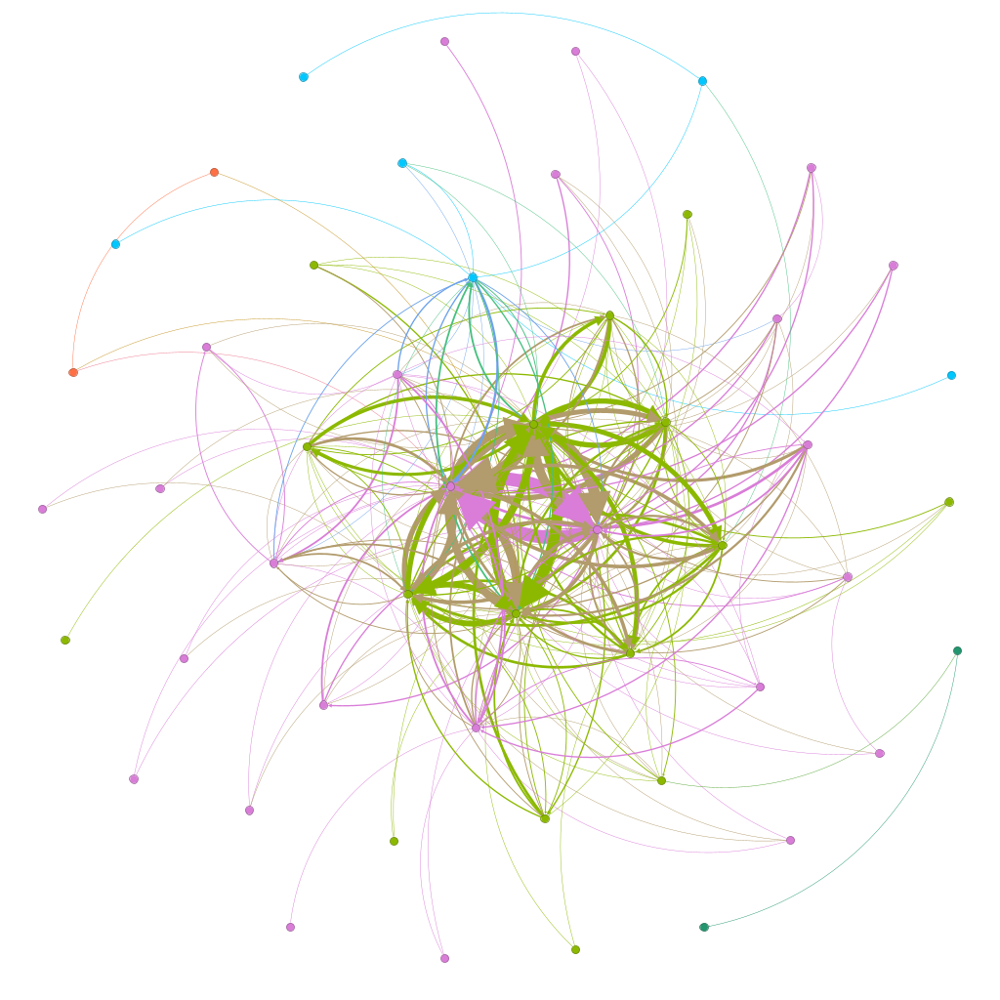
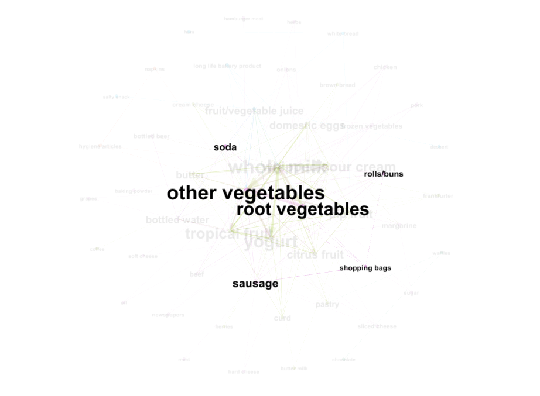

```{r setup, include=FALSE}
knitr::opts_chunk$set(
	message = FALSE,
	warning = FALSE,
	cache = TRUE
)

library(tidyverse)
library(ClusterR) # new for kmeans++
library(foreach)
library(mosaic)
library(rsample) 
library(modelr)
library(randomForest)
library(splines)
library(pdp)
library(ggcorrplot)
library(data.table)
library(gridExtra)
library(cluster)
library(arules)
library(arulesViz)
library(igraph)
```

##  1. Clustering and PCA
We use the K-means algorithm as our selected clustering algorithm. K-means tries to minimize within-cluster SSE. The K value used for the K-means clustering is chosen using the Gap Statistic. The default selection method looks for the first local peak up to the standard error in estimating En*[log(WK)]. The result for the best K value is also presented in the clusGap function output. In both cases, we get that K=5. The plot of the Gap Statistic selection method is presented below.

```{r K value, include=FALSE, warning=FALSE}
##  1. Clustering and PCA
wine = read.csv('https://raw.githubusercontent.com/annienguyen879/eco395m-exercises/main/exercise_4/wine.csv')

# Center and scale the data
X = wine[,(1:11)]
X = scale(X, center=TRUE, scale=TRUE)

gap_data=clusGap(x = X, FUNcluster = kmeans, K.max = 10, B = 50, nstart = 50)
gap_table <- data.table(gap_data$Tab)
gap_table[, k := .I]
gap_plot <- ggplot(gap_table, aes(k, gap)) + geom_line() + geom_point(size = 3) +
  geom_errorbar(aes(ymax = gap + SE.sim, ymin = gap - SE.sim), width = 0.25) +
  ggtitle("Clustering Results") +
  labs(x = "Number of Clusters", y = "Gap Statistic") +
  theme(plot.title = element_text(size = 16, hjust = 0.5, face = "bold"),
        axis.title = element_text(size = 12, face = "bold"))
```

Before running clustering algorithms, we note a few facts about red and white wine:

* White wine is more acidic and denser than red wine
* Red wine generally has less sugar and sulfur dioxide than white wine
* Red wine tends to have higher pH and alcohol content than white wine

We run the K means clustering algorithm and PCA on 11 chemical properties of 6500 different bottles of vinho verde wine. Clustering assumes that each data point is a member of one, and only one, cluster. That is, clusters are mutually exclusive. The results of the K mean clustering algorithm are presented below:

```{r K Means Clusters, include=FALSE, warning=FALSE}
# Run k-means with 5 clusters and 25 starts
kmeans5 = kmeans(X, center=5, nstart=25)

# Plot listed features
ggplot(wine) + 
  geom_point(aes(citric.acid, density, color=factor(kmeans5$cluster)))

ggplot(wine) + 
  geom_point(aes(total.sulfur.dioxide, residual.sugar, color=factor(kmeans5$cluster)))

ggplot(wine) + 
  geom_point(aes(alcohol, pH, color=factor(kmeans5$cluster)))
```
Recall the three facts listed above.

* White wine is more acidic and denser than red wine, so clusters with higher density and citric acid values (i.e. clusters in the upper-right side of the plot) should represent white wine. The plot suggests cluster 1 and 4 appear to be white wine. 
* Red wine generally has less sugar and sulfur dioxide than white wine, so clusters with lower less sugar and sulfur dioxide (i.e. clusters in the lower-left side of the plot) should represent red wine. The plot suggests cluster 4 and 5 appear to be red wine. 
* Red wine tends to have higher pH and alcohol content than white wine, so clusters with higher pH and alcohol content (i.e. clusters in the upper-right side of the plot) should represent red wine. The plot suggests cluster 5 appears to be red wine. 


To check the accuracy of the K means clustering algorithm, we examine citric acid and total sulfur dioxide content between red and white wine. We observe that the clustering algorithm was fairly accurate grouping red and white wine. We see that clusters 4 and 5 were grouped red wine. While cluster 1 had a few red wines, generally white wine was clustered in groups 1, 2, and 3. Additionally, while there was overlap in citric acid and total sulfur dioxide measurement content, we see white wine had outlier values that exceeded outlier values for red wine. Note this may be attributed to the fact that generally white wine is more acidic and red wine has lower sulfur dioxide (i.e. white wine has higher sulfur dioxide). Overall, these results are consistent with the data and graphs previously presented. The plots of citric acid and total sulfur dioxide content between red and white wine are presented below.

```{r K Means feature plots, include=FALSE, warning=FALSE}
# Compare features between red and white wine
wine$red_wine = ifelse(wine$color=='red', 1, 0)

ggplot(wine) + 
  geom_point(aes(red_wine, citric.acid, color=factor(kmeans5$cluster)))

ggplot(wine) + 
  geom_point(aes(red_wine, total.sulfur.dioxide, color=factor(kmeans5$cluster)))
```
We examine each of the 11 chemical properties by quality. As we see in the plots below, the clusters are not concentrated by quality ratings. That is, it does not appear that the K means algorithm is capable of distinguishing higher quality wine from lower quality wine. The 11 chemical properties by quality plots are presented below.

```{r K means distinguishing high quality wine plots, include=FALSE, warning=FALSE}
# Distinguishing high quality wine
fixed_acidity_plot=ggplot(wine) + 
  geom_point(aes(fixed.acidity, quality, color=factor(kmeans5$cluster)))

volatile_acidity_wine=ggplot(wine) + 
  geom_point(aes(volatile.acidity, quality, color=factor(kmeans5$cluster)))

citric_acid_plot=ggplot(wine) + 
  geom_point(aes(citric.acid, quality, color=factor(kmeans5$cluster)))

residual_sugar_plot=ggplot(wine) + 
  geom_point(aes(residual.sugar, quality, color=factor(kmeans5$cluster)))

chlorides_plot=ggplot(wine) + 
  geom_point(aes(chlorides, quality, color=factor(kmeans5$cluster)))

free_sulfur_dioxide_plot=ggplot(wine) + 
  geom_point(aes(free.sulfur.dioxide, quality, color=factor(kmeans5$cluster)))

total_sulfur_dioxide_plot=ggplot(wine) + 
  geom_point(aes(total.sulfur.dioxide, quality, color=factor(kmeans5$cluster)))

density_plot=ggplot(wine) + 
  geom_point(aes(density, quality, color=factor(kmeans5$cluster)))

pH_plot=ggplot(wine) + 
  geom_point(aes(pH, quality, color=factor(kmeans5$cluster)))

sulphates_plot=ggplot(wine) + 
  geom_point(aes(sulphates, quality, color=factor(kmeans5$cluster)))

alcohol_plot=ggplot(wine) + 
  geom_point(aes(alcohol, quality, color=factor(kmeans5$cluster)))

#Print plots in 2x2 grids
grid.arrange(fixed_acidity_plot, volatile_acidity_wine, citric_acid_plot, residual_sugar_plot, nrow = 2)

grid.arrange(chlorides_plot, free_sulfur_dioxide_plot, total_sulfur_dioxide_plot, density_plot, nrow = 2)

grid.arrange(pH_plot, sulphates_plot, alcohol_plot, nrow = 2)
```

The goal of PCA is to find low-dimensional summaries of high-dimensional data sets. PCA assumes that each data point is like a combination of multiple basic ingredients where the ingredients are not mutually exclusive. We can fiddle with ingredients continuously, but cluster membership only discretely. PCA assumes we use the same basic ingredients, just at differing amounts.

We would expect PCA to be the better dimensionality reduction technique for data on 11 chemical properties of 6500 bottles of wine. This is because red and white wine both contain the 11 characteristics, the wine types just differ in amounts. That is, red and white wine share the same ingredients, just at differing amounts. For example, as stated above, white wine is generally more acidic while red wine tends to have higher pH. But both wines will have both acidic and pH levels. PCA allows us to fiddle with ingredients continuously. The K means clustering algorithm is limited in that clustering algorithm cluster membership only discretely. In the wine type PCA plot below, we see red and white wine are clearly distinguished by component 2. That is, PCA was very clearly able to sort red wines to the left and white wines on the right. So very clearly, PCA was able to successfully pick up wine quality as a component. Furthermore, in the wine quality PCA plot below, we see a general vertical gradient in color (a gradient for Component 2). This indicates PCA was also able to pick up wine quality as a component. Hence, as expected, PCA was better at distinguishing red wine from white wine and identify wine quality using only the unsupervised information contained in the data on chemical properties.

```{r PCA, include=FALSE, warning=FALSE}
pca = prcomp(X, scale=TRUE, rank=2)
loadings = pca$rotation
scores = pca$x
qplot(scores[,1], scores[,2], color=wine$quality, xlab='Component 1', ylab='Component 2')
qplot(scores[,1], scores[,2], color=wine$red_wine, xlab='Component 1', ylab='Component 2')
```

##  2. Market segmentation

## ***Introduction***
We want to use market-research data based on tweets for NutrientH20 to come up with how the brand may position itself to different market segments for maximum appeal. So what are we working with? NutrientH20's advertising firm took a sample of the brand's Twitter followers, and collected each tweet by a follower over a seven-day period in June 2014. Amazon's Mechanical Turk service parsed through each tweet and allocated different categories to it, such as family or sports. Each tweet can have more than 1 category. There are a total of 36 pre-specified categories.

```{r}
social_marketing <- read.csv("social_marketing.csv")

ls(social_marketing)

```

The original dataset has 7882 observations with 37 variables (you can find a more detailed breakdown in the Appendix).

Our big task? Identifying market segments. Are NutrientH20's followers more sports-oriented, family-focused, or even fashion-obsessed? Getting these segments correct will help us tailor the firm's advertising strategies. 

## ***Methodology***

Before we run our magic, we need to make sure our data is centered and scaled so that we can get meaningful insights. Since there are still spam, adult, uncategorised and chatter categories that may not be useful for our overall analysis, I will drop these from dataset. 

I then center the data by subtracting the mean value of each variable from all of its values. This will ensure that the mean of each variable is zero. Centering the data makes sure that the clustering algorithm focuses on the patterns and differences in the data, rather than the absolute values of each variable. To scale the data, I divide each variable by its standard deviation. This will ensure that each variable has a similar scale and range. Scaling the data makes sure that the PCA and clustering algorithms treats each variable equally, regardless of its magnitude or unit of measurement.

I will then check for correlation within my data. I will first use principal component analysis (PCA) to identify which variables are most relevant in the dataset. Since this is a large dataset, PCA tries to simplify it by reducing the number of variables or dimensions involved. It is somewhat like taking a 1000-piece puzzle and contracting it into a 500-piece puzzle of the same picture. Based on this, I will check for appropriate clusters in the data. Clustering is what it sounds like. It groups similar objects together. So for example, if multiple tweets are revolving around sports, the algorithm would classify them into one cluster. 

### Correlation matrix 
```{r echo=FALSE}
#Clean data
X = social_marketing[,-c(1, 2, 6, 36, 37)]

# Center and scale the data
X = scale(X, center=TRUE, scale=TRUE)

# Extract the centers and scales from the rescaled data (which are named attributes)
mu = attr(X,"scaled:center")
sigma = attr(X,"scaled:scale")

#Correlation matrix

corr_matrix <- cor(X)
ggcorrplot(corr_matrix)

```

We can see that there are some variables that are highly correlated with each other. Therefore, we can use PCA to explain the data. 

### Principal Component Analysis (PCA) 
I generate 10 principal components of the data, since PC10 ends up explaining 65% of our data. Beyond this, we had little marginal increase in variation explained by summaries.   

```{r echo=FALSE}
# Now run PCA on the social marketing data
pc_sm = prcomp(X, rank=10, center = TRUE, scale=TRUE)

# these are the linear combinations of station-level data that define the PCs
# each column is a different PC, i.e. a different linear summary of the stations
#head(pc_sm$rotation)

# overall variation in 256 original features
summary(pc_sm)
plot(pc_sm)

# plotting variation 
pr_var <-  pc_sm$sdev ^ 2
pve <- pr_var / sum(pr_var)
#plot(pve, xlab = "Principal Component", ylab = "Proportion of Variance Explained", ylim = c(0,1), type = 'b')

#plot(cumsum(pve), xlab = "Principal Component", ylab = "Cummulative Proportion of Variance Explained", ylim = c(0,1), type = 'b')

```

```{r echo=FALSE}
# Checking loadings on PCA
round(pc_sm$rotation[,1:10],2) 
```

```{r include=FALSE}
# create a tidy summary of the loadings
loadings_summary = pc_sm$rotation %>%
  as.data.frame() %>%
  rownames_to_column('Category')

#PC1
loadings_summary %>%
  select(Category, PC1) %>%
  arrange(desc(PC1))

#PC2
loadings_summary %>%
  select(Category, PC2) %>%
  arrange(desc(PC2))

#PC3
loadings_summary %>%
  select(Category, PC3) %>%
  arrange(desc(PC3))

#PC4
loadings_summary %>%
  select(Category, PC4) %>%
  arrange(desc(PC4))

#PC5
loadings_summary %>%
  select(Category, PC5) %>%
  arrange(desc(PC5))

#PC6
loadings_summary %>%
  select(Category, PC6) %>%
  arrange(desc(PC6))

#PC7
loadings_summary %>%
  select(Category, PC7) %>%
  arrange(desc(PC7))

#PC8
loadings_summary %>%
  select(Category, PC8) %>%
  arrange(desc(PC8))

#PC9
loadings_summary %>%
  select(Category, PC9) %>%
  arrange(desc(PC9))

#PC10
loadings_summary %>%
  select(Category, PC10) %>%
  arrange(desc(PC10))

```

Based on these loadings, we can see that a few clear segments emerge. PC1 and PC2 signal families with kids. Variables such as beauty, crafts, cooking and fashion suggest that mothers are most likely an active audience of the brand, and sports and school indicate that they are focused on making sure their kids get enough nutrition for athletic and school activities. 

PC3 identifies a different group, that is most likely working adults in their 20s and college students. Variables such as politics, travel, and computers contribute the most to this summary. 

PC4 shows a new segment that is focused on fitness and the outdoors. This also reflects probably an audience in their 20s and 30s, since politics and news are also positive contributors.     

PC5 tells us about people who are focused on living an "influencer" lifestyle, where they emphasise beauty, fashion, cooking, and photo-sharing on their social media. 

PC6 brings us back to college students but those who are specifically into gaming and sports. 

It is difficult to glean a segment from PC7 and PC8, but seem to be well-paid homeowners probably in their 30s and 40s.

PC9 and PC10 also seem similar, indicating those with a more "bohemian" art-oriented lifestyle, where they like to support small businesses, maintain their home and gardens, and are interested in food, film, and especially music.    

Therefore, NutrientH20 should cater to the following segments: families with kids, college students, working adults, fitness enthusiasts, art-lovers and small-business supporters, and lifestyle influencers.


```{r echo=FALSE, message=FALSE, warning=FALSE}
# Run k-means with 6 clusters and 25 starts
clust1 = kmeans(X, 6, nstart=25)

scores = pc_sm$x

Y <- as.data.frame(cbind(X, scores))

ggplot(Y) + geom_point(aes(x=PC1, y=PC2, fill=factor(clust1$cluster)),
size=3, col="#7f7f7f", shape=21) + theme_bw(base_family="Helvetica")

#ggplot(Y) + geom_point(aes(x=PC1, y=PC3, fill=factor(clust1$cluster)),
#size=3, col="#7f7f7f", shape=21) + theme_bw(base_family="Helvetica")

#ggplot(Y) + geom_point(aes(x=PC1, y=PC4, fill=factor(clust1$cluster)),
#size=3, col="#7f7f7f", shape=21) + theme_bw(base_family="Helvetica")

#ggplot(Y) + geom_point(aes(x=PC1, y=PC5, fill=factor(clust1$cluster)),
#size=3, col="#7f7f7f", shape=21) + theme_bw(base_family="Helvetica")

#ggplot(Y) + geom_point(aes(x=PC1, y=PC6, fill=factor(clust1$cluster)),
#size=3, col="#7f7f7f", shape=21) + theme_bw(base_family="Helvetica")

#ggplot(Y) + geom_point(aes(x=PC1, y=PC7, fill=factor(clust1$cluster)),
#size=3, col="#7f7f7f", shape=21) + theme_bw(base_family="Helvetica")

#ggplot(Y) + geom_point(aes(x=PC1, y=PC8, fill=factor(clust1$cluster)),
#size=3, col="#7f7f7f", shape=21) + theme_bw(base_family="Helvetica")

#ggplot(Y) + geom_point(aes(x=PC2, y=PC3, fill=factor(clust1$cluster)),
#size=3, col="#7f7f7f", shape=21) + theme_bw(base_family="Helvetica")

#ggplot(Y) + geom_point(aes(x=PC3, y=PC4, fill=factor(clust1$cluster)),
#size=3, col="#7f7f7f", shape=21) + theme_bw(base_family="Helvetica")

#ggplot(Y) + geom_point(aes(x=PC5, y=PC6, fill=factor(clust1$cluster)),
#size=3, col="#7f7f7f", shape=21) + theme_bw(base_family="Helvetica")

#ggplot(Y) + geom_point(aes(x=PC3, y=PC6, fill=factor(clust1$cluster)),
#size=3, col="#7f7f7f", shape=21) + theme_bw(base_family="Helvetica")

#ggplot(Y) + geom_point(aes(x=PC4, y=PC6, fill=factor(clust1$cluster)),
#size=3, col="#7f7f7f", shape=21) + theme_bw(base_family="Helvetica")


```

When we check clusters within the PCAs, we can see the same patterns emerge. As an example, we can see the clusters within PC1 and PC2. We can see that the first cluster is found more within PC2. This is close to the group of families with kids identified earlier. Comparing PC1 and PC3, cluster 5 is clearly in PC3, while Cluster 1 is clearly not, giving us the working adults. Checking PC4 and PC1, we can see Cluster 6 is in PC4, that is fitness enthusiasts. Cluster 4 is more towards PC5 of "influencers", but there is a slight lack of clarity. Cluster 3 is in PC6, college students, but overlaps with some other clusters.  

##  3. Association rules for grocery purchases

In this section, we use data on grocery purchases to find some interesting association rules for customers' shopping baskets. The data that we have is in a `txt` file. Every row represents one customer's basket in which multiple items per row are separated by commas. First, we transform the `txt` file into a readable dataframe, so we can perform analysis. 

A sample of our data can be seen below:


```{r grocery_read, echo=FALSE}
groceries_read = read.table(file = "groceries.txt", sep = "\t", quote = "", row.names = NULL, header = FALSE, colClasses="character")
groceries_read <- groceries_read %>% mutate(id = row_number()) %>% separate_rows(V1,sep = ",") %>% rename("items"=V1) %>% select(id, items)
groceries_read <- data.frame(groceries_read)
groceries_read$id = as.factor(groceries_read$id)
head(groceries_read,10)
```

First, we split data into a list of grocery items for each customer and remove any duplicates. Then, we run the `apriori` algorithm to look at rules, where support is greater than 0.005 and confidence is greater than 0.1.

```{r echo=FALSE}
groceries = split(x=groceries_read$items, f=groceries_read$id)
groceries = lapply(groceries, unique)
groceries_trans = as(groceries, "transactions")
rules_groceries = apriori(groceries_trans, 
                     parameter=list(support=.005, confidence=.1, maxlen=4))
```

Inspecting at the rules, we see that 1,582 rules have been generated. We generate plots to visualize the rules in order to provide us additional insight on confidence, support, and lift.

```{r include=FALSE}
## we have 1582 rules
paste("Number of rules:", nrow(arules::inspect(rules_groceries)))
```


```{r rules_plots, echo=FALSE}
plot(rules_groceries)
plot(rules_groceries, measure = c("support", "lift"), shading = "confidence")
plot(rules_groceries, method='two-key plot')
```

In the second graph, it appears that confidence is greater when lift is greater than 2. In the first graph, it also seems like higher confidence rules were cluster near the bottom, while in the third graph, we see that order 1 is also clustered at the bottom. As a result, it may be better to keep the confidence at about 0.15 to ensure that all orders are represented. Based on the plots above, a good threshold may be when lift is greater than 2 and when confidence is above 0.15. Under these conditions, we would have a subset of 495 rules.

```{r include=FALSE}
# can now look at subsets driven by the plot
arules::inspect(subset(rules_groceries, support > 0.03))
arules::inspect(subset(rules_groceries, confidence > 0.5))
arules::inspect(subset(rules_groceries, lift > 2.5))
arules::inspect(subset(rules_groceries, lift > 2 & confidence > 0.15))
```

Next, we will produce a visualization for our associations through a program called Gephi.

```{r igraph, echo=FALSE}
## Best combo so far
groceries_graph = associations2igraph(subset(rules_groceries, lift > 2 & confidence > 0.15), associationsAsNodes = FALSE)
igraph::write_graph(groceries_graph, file='groceriesliftcombo.graphml', format = "graphml")
```



The item sets we discovered makes sense. For example, the items associated with "shopping bags" include soda, vegetables, rolls/buns, and sausage, which are all items necessary for a picnic or barbecue. 





From this section, we analyzed the association between different grocery items based on customers' purchase baskets. We found interesting association rules and produce a visualization of that network of items using Gephi.


