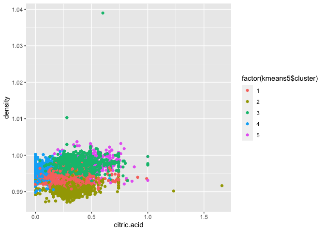
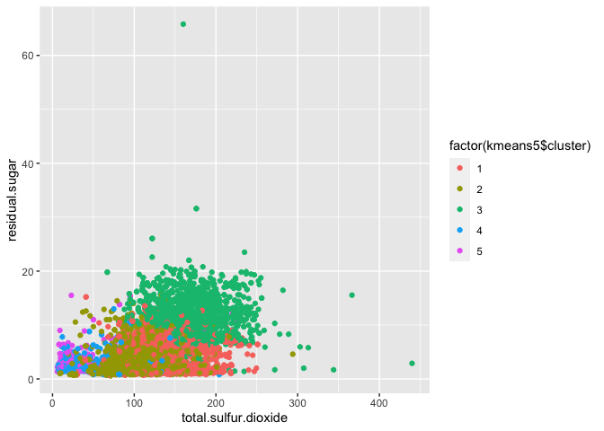
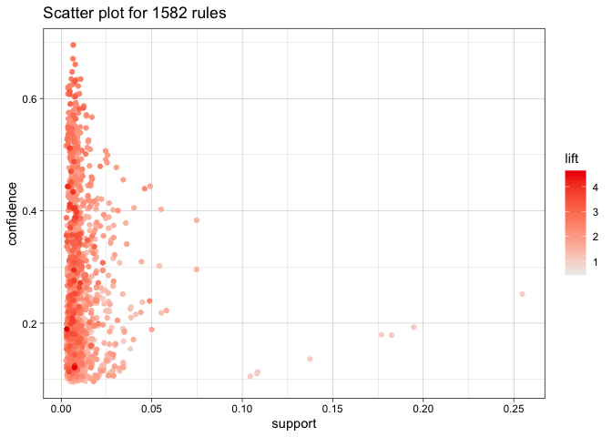

# Homework 4
## ECO 395M: Data Mining and Statistical Learning 

## Soo Jee Choi, Annie Nguyen, and Tarini Sudhakar

### 2023-04-17

## 1. Clustering and PCA

We use the K-means algorithm as our selected clustering algorithm.
K-means tries to minimize within-cluster SSE. The K value used for the
K-means clustering is chosen using the Gap Statistic. The default
selection method looks for the first local peak up to the standard error
in estimating En\*\[log(WK)\]. The result for the best K value is also
presented in the clusGap function output. In both cases, we get that
K=5. The plot of the Gap Statistic selection method is presented below:

Before running clustering algorithms, we note a few facts about red and
white wine:

-   White wine is more acidic and denser than red wine
-   Red wine generally has less sugar and sulfur dioxide than white wine
-   Red wine tends to have higher pH and alcohol content than white wine

We run the K means clustering algorithm and PCA on 11 chemical
properties of 6500 different bottles of vinho verde wine. Clustering
assumes that each data point is a member of one, and only one, cluster.
That is, clusters are mutually exclusive. The results of the K mean
clustering algorithm are presented below:

Recall the three facts listed above.

-   White wine is more acidic and denser than red wine, so clusters with
    higher density and citric acid values (i.e. clusters in the
    upper-right side of the plot) should represent white wine. The plot
    suggests cluster 1 and 4 appear to be white wine.
-   Red wine generally has less sugar and sulfur dioxide than white
    wine, so clusters with lower less sugar and sulfur dioxide
    (i.e. clusters in the lower-left side of the plot) should represent
    red wine. The plot suggests cluster 4 and 5 appear to be red wine.
-   Red wine tends to have higher pH and alcohol content than white
    wine, so clusters with higher pH and alcohol content (i.e. clusters
    in the upper-right side of the plot) should represent red wine. The
    plot suggests cluster 5 appears to be red wine.

To check the accuracy of the K means clustering algorithm, we examine
citric acid and total sulfur dioxide content between red and white wine.
We observe that the clustering algorithm was fairly accurate grouping
red and white wine. We see that clusters 4 and 5 were grouped red wine.
While cluster 1 had a few red wines, generally white wine was clustered
in groups 1, 2, and 3. Additionally, while there was overlap in citric
acid and total sulfur dioxide measurement content, we see white wine had
outlier values that exceeded outlier values for red wine. Note this may
be attributed to the fact that generally white wine is more acidic and
red wine has lower sulfur dioxide (i.e. white wine has higher sulfur
dioxide). Overall, these results are consistent with the data and graphs
previously presented. The plots of citric acid and total sulfur dioxide
content between red and white wine are presented below:

We examine each of the 11 chemical properties by quality. As we see in
the plots below, the clusters are not concentrated by quality ratings.
That is, it does not appear that the K means algorithm is capable of
distinguishing higher quality wine from lower quality wine. The 11
chemical properties by quality plots are presented below:

The goal of PCA is to find low-dimensional summaries of high-dimensional
data sets. PCA assumes that each data point is like a combination of
multiple basic ingredients where the ingredients are not mutually
exclusive. We can fiddle with ingredients continuously, but cluster
membership only discretely. PCA assumes we use the same basic
ingredients, just at differing amounts.

We would expect PCA to be the better dimensionality reduction technique
for data on 11 chemical properties of 6500 bottles of wine. This is
because red and white wine both contain the 11 characteristics, the wine
types just differ in amounts. That is, red and white wine share the same
ingredients, just at differing amounts. For example, as stated above,
white wine is generally more acidic while red wine tends to have higher
pH. But both wines will have both acidic and pH levels. PCA allows us to
fiddle with ingredients continuously. The K means clustering algorithm
is limited in that clustering algorithm cluster membership only
discretely. In the wine type PCA plot below, we see red and white wine
are clearly distinguished by component 2. That is, PCA was very clearly
able to sort red wines to the left and white wines on the right. So very
clearly, PCA was able to successfully pick up wine quality as a
component. Furthermore, in the wine quality PCA plot below, we see a
general vertical gradient in color (a gradient for Component 2). This
indicates PCA was also able to pick up wine quality as a component.
Hence, as expected, PCA was better at distinguishing red wine from white
wine and identify wine quality using only the unsupervised information
contained in the data on chemical properties.

## 2. Market segmentation

## ***Introduction***

We want to use market-research data based on tweets for NutrientH20 to
come up with how the brand may position itself to different market
segments for maximum appeal. So what are we working with? NutrientH20’s
advertising firm took a sample of the brand’s Twitter followers, and
collected each tweet by a follower over a seven-day period in June 2014.
Amazon’s Mechanical Turk service parsed through each tweet and allocated
different categories to it, such as family or sports. Each tweet can
have more than 1 category. There are a total of 36 pre-specified
categories.

    social_marketing <- read.csv("social_marketing.csv")

    ls(social_marketing)

    ##  [1] "adult"            "art"              "automotive"       "beauty"          
    ##  [5] "business"         "chatter"          "college_uni"      "computers"       
    ##  [9] "cooking"          "crafts"           "current_events"   "dating"          
    ## [13] "eco"              "family"           "fashion"          "food"            
    ## [17] "health_nutrition" "home_and_garden"  "music"            "news"            
    ## [21] "online_gaming"    "outdoors"         "parenting"        "personal_fitness"
    ## [25] "photo_sharing"    "politics"         "religion"         "school"          
    ## [29] "shopping"         "small_business"   "spam"             "sports_fandom"   
    ## [33] "sports_playing"   "travel"           "tv_film"          "uncategorized"   
    ## [37] "X"

The original dataset has 7882 observations with 37 variables (you can
find a more detailed breakdown in the Appendix).

Our big task? Identifying market segments. Are NutrientH20’s followers
more sports-oriented, family-focused, or even fashion-obsessed? Getting
these segments correct will help us tailor the firm’s advertising
strategies.

## ***Methodology***

Before we run our magic, we need to make sure our data is centered and
scaled so that we can get meaningful insights. Since there are still
spam, adult, uncategorised and chatter categories that may not be useful
for our overall analysis, I will drop these from dataset.

I then center the data by subtracting the mean value of each variable
from all of its values. This will ensure that the mean of each variable
is zero. Centering the data makes sure that the clustering algorithm
focuses on the patterns and differences in the data, rather than the
absolute values of each variable. To scale the data, I divide each
variable by its standard deviation. This will ensure that each variable
has a similar scale and range. Scaling the data makes sure that the PCA
and clustering algorithms treats each variable equally, regardless of
its magnitude or unit of measurement.

I will then check for correlation within my data. I will first use
principal component analysis (PCA) to identify which variables are most
relevant in the dataset. Since this is a large dataset, PCA tries to
simplify it by reducing the number of variables or dimensions involved.
It is somewhat like taking a 1000-piece puzzle and contracting it into a
500-piece puzzle of the same picture. Based on this, I will check for
appropriate clusters in the data. Clustering is what it sounds like. It
groups similar objects together. So for example, if multiple tweets are
revolving around sports, the algorithm would classify them into one
cluster.

### Correlation matrix

We can see that there are some variables that are highly correlated with
each other. Therefore, we can use PCA to explain the data.

### Principal Component Analysis (PCA)

I generate 10 principal components of the data, since PC10 ends up
explaining 65% of our data. Beyond this, we had little marginal increase
in variation explained by summaries.

    ## Importance of first k=10 (out of 32) components:
    ##                           PC1     PC2     PC3     PC4     PC5     PC6     PC7
    ## Standard deviation     2.0987 1.66483 1.59119 1.52912 1.46728 1.28477 1.21616
    ## Proportion of Variance 0.1376 0.08661 0.07912 0.07307 0.06728 0.05158 0.04622
    ## Cumulative Proportion  0.1376 0.22426 0.30338 0.37645 0.44372 0.49531 0.54153
    ##                            PC8     PC9    PC10
    ## Standard deviation     1.17377 1.05325 0.99329
    ## Proportion of Variance 0.04305 0.03467 0.03083
    ## Cumulative Proportion  0.58458 0.61925 0.65008

    ##                   PC1   PC2   PC3   PC4   PC5   PC6   PC7   PC8   PC9  PC10
    ## current_events   0.09 -0.05  0.05 -0.02  0.04 -0.13  0.19 -0.11  0.00  0.07
    ## travel           0.12 -0.05  0.44  0.11  0.05  0.00 -0.31 -0.16  0.12 -0.04
    ## photo_sharing    0.16 -0.27 -0.03 -0.13  0.20 -0.06  0.31 -0.29  0.04 -0.12
    ## tv_film          0.09 -0.08  0.10 -0.12 -0.18 -0.50 -0.05  0.30  0.12  0.07
    ## sports_fandom    0.30  0.30 -0.07 -0.03  0.02  0.06  0.09  0.07  0.05  0.05
    ## politics         0.13 -0.02  0.50  0.17  0.09  0.10 -0.04  0.01  0.05 -0.03
    ## food             0.31  0.20 -0.11  0.08 -0.09 -0.02 -0.10 -0.04  0.13 -0.02
    ## family           0.25  0.19 -0.06 -0.05 -0.01  0.06  0.09 -0.05  0.09 -0.08
    ## home_and_garden  0.11 -0.05  0.03  0.00 -0.04 -0.11  0.05  0.09 -0.36  0.12
    ## music            0.12 -0.15  0.00 -0.11 -0.04 -0.15  0.02  0.08  0.28  0.71
    ## news             0.13  0.02  0.35  0.16  0.04  0.16  0.27  0.39 -0.05 -0.01
    ## online_gaming    0.07 -0.10  0.07 -0.29 -0.44  0.27  0.01 -0.07 -0.02 -0.15
    ## shopping         0.11 -0.16  0.02 -0.06  0.11 -0.18  0.43 -0.41  0.02 -0.10
    ## health_nutrition 0.13 -0.21 -0.19  0.44 -0.23  0.02 -0.02 -0.02  0.03 -0.02
    ## college_uni      0.09 -0.13  0.10 -0.33 -0.44  0.17  0.01 -0.05  0.05  0.05
    ## sports_playing   0.13 -0.13  0.06 -0.24 -0.33  0.21 -0.01 -0.06 -0.07 -0.01
    ## cooking          0.18 -0.37 -0.17 -0.05  0.22  0.17 -0.13  0.17  0.12 -0.09
    ## eco              0.14 -0.10 -0.02  0.12 -0.06 -0.10  0.15 -0.19  0.00 -0.08
    ## computers        0.14 -0.05  0.38  0.11  0.09  0.07 -0.27 -0.25  0.11 -0.02
    ## business         0.13 -0.09  0.11 -0.01  0.05 -0.15  0.00 -0.19 -0.11  0.18
    ## outdoors         0.14 -0.17 -0.11  0.39 -0.19  0.06  0.03  0.08  0.00  0.09
    ## crafts           0.19  0.02  0.00 -0.02 -0.04 -0.25 -0.06  0.01 -0.08 -0.34
    ## automotive       0.13  0.04  0.19  0.04  0.04  0.16  0.51  0.35 -0.07 -0.01
    ## art              0.10 -0.07  0.06 -0.09 -0.13 -0.46 -0.11  0.29 -0.02 -0.40
    ## religion         0.32  0.30 -0.11 -0.04  0.02  0.01 -0.10 -0.06  0.09  0.05
    ## beauty           0.20 -0.25 -0.14 -0.17  0.29  0.14 -0.14  0.19  0.05 -0.03
    ## parenting        0.31  0.28 -0.11 -0.02  0.03  0.05 -0.04 -0.04  0.05  0.01
    ## dating           0.10 -0.07  0.03  0.03  0.01  0.01 -0.16 -0.05 -0.76  0.17
    ## school           0.29  0.19 -0.10 -0.06  0.08 -0.01 -0.05 -0.05 -0.25  0.04
    ## personal_fitness 0.14 -0.21 -0.18  0.42 -0.22  0.01  0.00 -0.03  0.03 -0.02
    ## fashion          0.18 -0.32 -0.12 -0.17  0.28  0.14 -0.16  0.15 -0.04 -0.06
    ## small_business   0.11 -0.09  0.10 -0.09 -0.01 -0.23 -0.01 -0.02 -0.07  0.21

Based on these loadings, we can see that a few clear segments emerge.
PC1 and PC2 signal families with kids. Variables such as beauty, crafts,
cooking and fashion suggest that mothers are most likely an active
audience of the brand, and sports and school indicate that they are
focused on making sure their kids get enough nutrition for athletic and
school activities.

PC3 identifies a different group, that is most likely working adults in
their 20s and college students. Variables such as politics, travel, and
computers contribute the most to this summary.

PC4 shows a new segment that is focused on fitness and the outdoors.
This also reflects probably an audience in their 20s and 30s, since
politics and news are also positive contributors.

PC5 tells us about people who are focused on living an “influencer”
lifestyle, where they emphasise beauty, fashion, cooking, and
photo-sharing on their social media.

PC6 brings us back to college students but those who are specifically
into gaming and sports.

It is difficult to glean a segment from PC7 and PC8, but seem to be
well-paid homeowners probably in their 30s and 40s.

PC9 and PC10 also seem similar, indicating those with a more “bohemian”
art-oriented lifestyle, where they like to support small businesses,
maintain their home and gardens, and are interested in food, film, and
especially music.

Therefore, NutrientH20 should cater to the following segments: families
with kids, college students, working adults, fitness enthusiasts,
art-lovers and small-business supporters, and lifestyle influencers.

When we check clusters within the PCAs, we can see the same patterns
emerge. As an example, we can see the clusters within PC1 and PC2. We
can see that the first cluster is found more within PC2. This is close
to the group of families with kids identified earlier. Comparing PC1 and
PC3, cluster 5 is clearly in PC3, while Cluster 1 is clearly not, giving
us the working adults. Checking PC4 and PC1, we can see Cluster 6 is in
PC4, that is fitness enthusiasts. Cluster 4 is more towards PC5 of
“influencers”, but there is a slight lack of clarity. Cluster 3 is in
PC6, college students, but overlaps with some other clusters.

## 3. Association rules for grocery purchases

In this section, we use data on grocery purchases to find some
interesting association rules for customers’ shopping baskets. The data
that we have is in a `txt` file. Every row represents one customer’s
basket in which multiple items per row are separated by commas. First,
we transform the `txt` file into a readable dataframe, so we can perform
analysis.

A sample of our data can be seen below:

    ##    id               items
    ## 1   1        citrus fruit
    ## 2   1 semi-finished bread
    ## 3   1           margarine
    ## 4   1         ready soups
    ## 5   2      tropical fruit
    ## 6   2              yogurt
    ## 7   2              coffee
    ## 8   3          whole milk
    ## 9   4           pip fruit
    ## 10  4              yogurt

First, we split data into a list of grocery items for each customer and
remove any duplicates. Then, we run the `apriori` algorithm to look at
rules, where support is greater than 0.005 and confidence is greater
than 0.1.

    ## Apriori
    ## 
    ## Parameter specification:
    ##  confidence minval smax arem  aval originalSupport maxtime support minlen
    ##         0.1    0.1    1 none FALSE            TRUE       5   0.005      1
    ##  maxlen target  ext
    ##       4  rules TRUE
    ## 
    ## Algorithmic control:
    ##  filter tree heap memopt load sort verbose
    ##     0.1 TRUE TRUE  FALSE TRUE    2    TRUE
    ## 
    ## Absolute minimum support count: 49 
    ## 
    ## set item appearances ...[0 item(s)] done [0.00s].
    ## set transactions ...[169 item(s), 9835 transaction(s)] done [0.00s].
    ## sorting and recoding items ... [120 item(s)] done [0.00s].
    ## creating transaction tree ... done [0.00s].
    ## checking subsets of size 1 2 3 4 done [0.00s].
    ## writing ... [1582 rule(s)] done [0.00s].
    ## creating S4 object  ... done [0.00s].

Inspecting at the rules, we see that 1,582 rules have been generated. We
generate plots to visualize the rules in order to provide us additional
insight on confidence, support, and lift.

In the second graph, it appears that confidence is greater when lift is
greater than 2. In the first graph, it also seems like higher confidence
rules were cluster near the bottom, while in the third graph, we see
that order 1 is also clustered at the bottom. As a result, it may be
better to keep the confidence at about 0.15 to ensure that all orders
are represented. Based on the plots above, a good threshold may be when
lift is greater than 2 and when confidence is above 0.15. Under these
conditions, we would have a subset of 495 rules.

Next, we will produce a visualization for our associations through a
program called Gephi.

The item sets we discovered makes sense. For example, the items
associated with “shopping bags” include soda, vegetables, rolls/buns,
and sausage, which are all items necessary for a picnic or barbecue.

From this section, we analyzed the association between different grocery
items based on customers’ purchase baskets. We found interesting
association rules and produce a visualization of that network of items
using Gephi.
